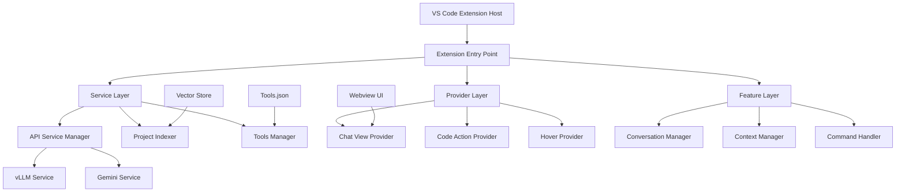

# 1. Genel Bakış

## 1.1 Proje Tanımı ve Vizyon

### 🎯 İvme Nedir?

**İvme**, Visual Studio Code için geliştirilmiş next-generation yapay zeka destekli kod geliştirme asistanıdır. Modern yazılım geliştirme süreçlerini hızlandırmak ve geliştiricilerin üretkenliğini artırmak amacıyla tasarlanmıştır.

### 🚀 Vizyon ve Misyon

**Vizyon**: Yapay zeka ile desteklenen, geliştiricilerin en güvendiği ve en verimli çalıştığı kod geliştirme ortamını yaratmak.

**Misyon**: 
- Kod kalitesini artırmak
- Geliştirme süresini kısaltmak  
- Karmaşık görevleri basitleştirmek
- Öğrenme eğrisini düzleştirmek

### 🎨 Tasarım Prensipleri

1. **Developer-First**: Geliştirici deneyimi her şeyden önce gelir
2. **AI-Powered**: Yapay zeka, insan zekasını destekler, yerine geçmez
3. **Context-Aware**: Mevcut kod bağlamını anlar ve ona göre davranır
4. **Extensible**: Yeni özellikler ve araçlar kolayca eklenebilir
5. **Privacy-Focused**: Kullanıcı verilerinin güvenliği ve mahremiyeti öncelik

---

## 1.2 Temel Özellikler ve Yetenekler

### 🤖 Yapay Zeka Entegrasyonu

#### Çoklu LLM Desteği
- **vLLM Integration**
  - Yerel sunucu desteği
  - OpenAI uyumlu API
  - Hızlı response süreleri
  - Veri güvenliği
  - Özelleştirilebilir modeller

- **Google Gemini Integration**
  - Bulut tabanlı güçlü modeller
  - Multimodal yetenekler
  - Sürekli güncelenen modeller
  - Geniş dil desteği

#### Akıllı Model Seçimi
```typescript
// Otomatik model seçimi
const bestModel = await aiManager.selectOptimalModel({
  task: 'code_generation',
  complexity: 'high',
  latencyRequirement: 'low',
  privacyLevel: 'strict'
});
```

### 💼 Çalışma Modları

#### 1. Chat Modu 
**Amaç**: Genel kod danışmanlığı ve sohbet
- Serbest form konuşmalar
- Dosya yükleme ve analiz
- Kod snippet'leri analizi
- Çoklu dil desteği
- Konuşma geçmişi

**Kullanım Senaryoları**:
- Kod hakkında soru sorma
- Algoritma açıklaması isteme
- Best practice önerileri alma
- Debugging yardımı

#### 2. Agent Modu
**Amaç**: Aktif kod üzerinde direkt çalışma
- Dosya bağlam takibi
- Seçim bazlı işlemler
- Otomatik kod completion
- Context-aware suggestions

**Kullanım Senaryoları**:
- Aktif dosya üzerinde çalışma
- Seçili kod bloğunu düzenleme
- Refactoring işlemleri
- Otomatik kod üretimi

### 🛠️ Kod Analizi ve İndeksleme

#### Deep Code Understanding
```typescript
interface CodeAnalysisResult {
  ast: ASTNode[];
  dependencies: string[];
  complexity: ComplexityMetrics;
  patterns: CodePattern[];
  issues: CodeIssue[];
  suggestions: Suggestion[];
}
```

#### Vector-Based Code Search
- **Semantic Search**: Anlamsal kod arama
- **Cross-Language Support**: Çoklu dil desteği
- **Real-time Indexing**: Gerçek zamanlı indeksleme
- **Incremental Updates**: Artımlı güncellemeler

### 🎯 Planner Agent Sistemi

#### Otomatik Görev Planlama
```json
{
  "task": "Kullanıcı yönetim sistemi ekle",
  "plan": {
    "steps": [
      {
        "step": 1,
        "action": "create_user_model",
        "tool": "create_file",
        "args": {"path": "src/models/User.ts"}
      },
      {
        "step": 2, 
        "action": "implement_auth_service",
        "tool": "create_file",
        "args": {"path": "src/services/AuthService.ts"}
      }
    ]
  }
}
```

#### Plan Execution Engine
- **Step-by-Step Execution**: Adım adım uygulama
- **Error Recovery**: Hata durumunda geri alma
- **Progress Tracking**: İlerleme takibi
- **Human Approval**: İnsan onayı sistemi

### 🔧 Dinamik Araç Sistemi

#### Built-in Tools
| Araç | Açıklama | Parametreler |
|------|----------|-------------|
| `create_file` | Yeni dosya oluşturma | `path`, `content` |
| `edit_file` | Dosya düzenleme | `path`, `changes` |
| `append_file` | Dosya sonuna ekleme | `path`, `content` |
| `check_index` | İndeks sorgulama | `query`, `filters` |
| `retrieve_chunks` | Kod parçası getirme | `similarity`, `count` |
| `locate_code` | Kod bulma | `pattern`, `scope` |

#### Custom Tool Creation
```typescript
interface CustomTool {
  name: string;
  description: string;
  parameters: JSONSchema;
  execute: (args: any) => Promise<any>;
  validation?: (args: any) => boolean;
}
```

---

## 1.3 Teknik Altyapı

### 🏗️ Architecture Overview



### 💾 Veri Katmanları

#### 1. Extension Storage
- **Workspace State**: Proje bazlı ayarlar
- **Global State**: Kullanıcı tercihleri
- **Secret Storage**: API anahtarları

#### 2. File System
- **`.ivme/`**: Proje dizini
  - `vector_store.json`: Kod indeksi
  - `planner_index.json`: Mimari harita
  - `tools.json`: Araç tanımları

#### 3. Memory Storage
- **Conversation History**: Sohbet geçmişi
- **Context Cache**: Bağlam önbelleği
- **Embedding Cache**: Vektör önbelleği

### 🔄 API Architecture

#### RESTful Design
```typescript
interface APIEndpoint {
  method: 'GET' | 'POST' | 'PUT' | 'DELETE';
  path: string;
  handler: RequestHandler;
  middleware?: Middleware[];
  validation?: ValidationSchema;
}
```

#### Event-Driven Communication
```typescript
// Extension Events
enum ExtensionEvents {
  FILE_CHANGED = 'file:changed',
  SELECTION_CHANGED = 'selection:changed',
  MODE_SWITCHED = 'mode:switched',
  PLAN_GENERATED = 'plan:generated',
  TOOL_EXECUTED = 'tool:executed'
}
```

### 🔐 Güvenlik ve Gizlilik

#### Data Protection
- **Local-First**: Veriler öncelikle yerel kalır
- **Encryption**: Sensitive data şifreleme
- **API Key Management**: Güvenli anahtar saklama
- **Audit Logging**: İşlem günlükleri

#### Privacy Controls
- **Opt-in Analytics**: İsteğe bağlı telemetri
- **Data Retention**: Veri saklama politikaları
- **User Consent**: Kullanıcı onay sistemi

---

## 1.4 Performans ve Ölçeklenebilirlik

### ⚡ Performance Metrics

#### Response Times
- **Local LLM**: < 500ms (ortalama)
- **Cloud LLM**: < 2000ms (ortalama)
- **Code Analysis**: < 100ms (cache hit)
- **Search Queries**: < 50ms (indexed)

#### Resource Usage
```typescript
interface ResourceMetrics {
  memoryUsage: {
    extension: number; // MB
    webview: number;   // MB
    indexCache: number; // MB
  };
  cpuUsage: {
    idle: number;      // %
    indexing: number;  // %
    analysis: number;  // %
  };
  diskUsage: {
    vectorStore: number; // MB
    cache: number;       // MB
    logs: number;        // MB
  };
}
```

### 📈 Scalability Features

#### Horizontal Scaling
- **Multi-Instance Support**: Çoklu instance desteği
- **Load Balancing**: Yük dengeleme
- **Distributed Indexing**: Dağıtık indeksleme

#### Vertical Scaling
- **Memory Management**: Akıllı bellek yönetimi
- **CPU Optimization**: CPU kullanım optimizasyonu
- **Disk Caching**: Disk önbellek stratejileri

---

## 1.5 Kullanıcı Deneyimi (UX)

### 🎨 Design Philosophy

#### Minimalist Interface
- **Clean UI**: Temiz ve sade arayüz
- **Contextual Actions**: Bağlama uygun eylemler
- **Progressive Disclosure**: Aşamalı bilgi açığa çıkarma

#### Accessibility
- **Keyboard Navigation**: Klavye ile gezinme
- **Screen Reader Support**: Ekran okuyucu desteği
- **High Contrast Mode**: Yüksek kontrast modu
- **Customizable UI**: Özelleştirilebilir arayüz

### 🌐 Internationalization (i18n)

#### Supported Languages
- **Turkish (tr)**: Ana dil desteği
- **English (en)**: International support

#### Localization Features
```typescript
interface LocaleConfig {
  language: 'tr' | 'en';
  prompts: PromptTemplates;
  ui: UITexts;
  dateFormat: string;
  numberFormat: NumberFormatOptions;
}
```

### 📱 Cross-Platform Compatibility

#### Supported Platforms
- **Windows**: Native support
- **macOS**: Native support  
- **Linux**: Native support

#### Browser Compatibility
- **Electron (VS Code)**: Primary target
- **Chrome/Chromium**: Webview engine
- **Modern Standards**: ES2022, CSS3

---

## 1.6 Kalite ve Test Stratejisi

### 🧪 Testing Pyramid

#### Unit Tests
```typescript
describe('ApiServiceManager', () => {
  it('should switch between services correctly', async () => {
    const manager = new ApiServiceManager();
    await manager.switchService('gemini');
    expect(manager.getActiveService()).toBe('gemini');
  });
});
```

#### Integration Tests
- **Service Integration**: Servis entegrasyon testleri
- **Provider Testing**: Provider test suite'leri
- **End-to-End**: E2E user journey testleri

#### Performance Tests
- **Load Testing**: Yük testleri
- **Stress Testing**: Stres testleri
- **Memory Leak Detection**: Bellek sızıntı tespiti

### 📊 Quality Metrics

#### Code Quality
- **TypeScript Strict Mode**: Katı tip kontrolü
- **ESLint Rules**: Kod kalite kuralları
- **Prettier Formatting**: Kod formatlama
- **Code Coverage**: > 80% test coverage

#### Performance Benchmarks
```typescript
interface PerformanceBenchmarks {
  startup: {
    cold: number;  // ms
    warm: number;  // ms
  };
  indexing: {
    smallProject: number;  // ms (< 100 files)
    mediumProject: number; // ms (100-1000 files)
    largeProject: number;  // ms (> 1000 files)
  };
  memory: {
    baseline: number;    // MB
    withIndex: number;   // MB
    underLoad: number;   // MB
  };
}
```

---

## 1.7 Roadmap ve Gelecek Planları

### 🗺️ Short-term Goals (1-3 months)

#### Q1 2024
- **ReAct Mode**: Reasoning + Acting döngüsü
- **Advanced Refactoring**: Gelişmiş refactoring araçları  
- **Team Collaboration**: Takım çalışması özellikleri

#### Q2 2024
- **Custom Model Support**: Özel model entegrasyonu
- **Plugin Architecture**: Plugin sistemi
- **Advanced Analytics**: Gelişmiş analitik

### 🚀 Long-term Vision (6-12 months)

#### Advanced AI Features
- **Code Generation from Comments**: Yorum'dan kod üretimi
- **Automated Testing**: Otomatik test üretimi
- **Performance Optimization**: Otomatik performans optimizasyonu

#### Enterprise Features
- **SSO Integration**: Single Sign-On
- **Team Analytics**: Takım analitikleri
- **Custom Deployment**: Özelleştirilmiş dağıtım

### 🔬 Research Areas

#### Emerging Technologies
- **Large Language Models**: Yeni LLM entegrasyonları
- **Code Understanding**: Gelişmiş kod anlayışı
- **Multi-modal AI**: Çok modlu AI yetenekleri

---

## 1.8 Topluluk ve Ekosistem

### 👥 Community

#### Open Source Contribution
- **GitHub Repository**: Açık kaynak geliştirme
- **Issue Tracking**: Hata takibi ve özellik istekleri
- **Pull Requests**: Topluluk katkıları
- **Code Reviews**: Kod inceleme süreci

#### Developer Resources
- **API Documentation**: Detaylı API dokümantasyonu
- **Tutorial Videos**: Eğitim videoları
- **Blog Posts**: Teknik blog yazıları
- **Conference Talks**: Konferans sunumları

### 🤝 Partnerships

#### Technology Partners
- **AI Providers**: vLLM, Google AI
- **Cloud Platforms**: AWS, Azure, GCP
- **Development Tools**: VS Code Marketplace

#### Research Collaborations
- **Universities**: Akademik araştırma
- **AI Research Labs**: AI araştırma laboratuvarları
- **Open Source Projects**: Açık kaynak proje katkıları

---

## 1.9 Lisanslar ve Yasal Bilgiler

### 📄 Licensing

#### Extension License
- **Type**: MIT License
- **Commercial Use**: Allowed
- **Modification**: Allowed
- **Distribution**: Allowed
- **Patent Use**: Allowed

#### Third-party Dependencies
```json
{
  "dependencies": {
    "@google/generative-ai": "^0.11.3",
    "axios": "^1.7.2",
    "cohere-ai": "^7.18.1"
  }
}
```

### ⚖️ Compliance

#### Data Protection
- **GDPR Compliance**: Avrupa veri koruma
- **CCPA Compliance**: California veri koruma
- **SOC 2**: Güvenlik standartları

#### Export Control
- **ITAR Compliance**: Uluslararası silah ticareti
- **EAR Compliance**: İhracat yönetim kuralları

---

<div align="center">
  <h2>🎯 İvme ile Gelecek Nesil Kod Geliştirme</h2>
  <p><em>Yapay zeka destekli geliştirme deneyiminin yeni standardı</em></p>
</div>
