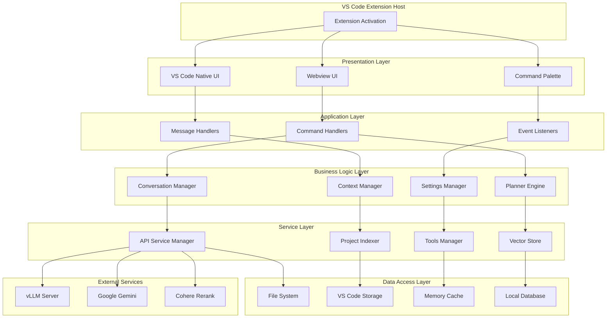
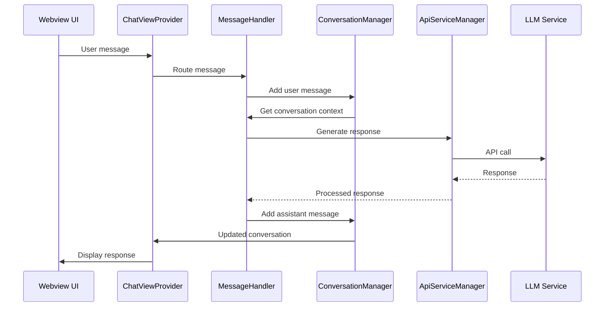
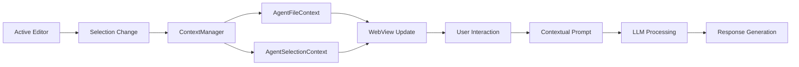

# 2. Mimari ve Ana Bileşenler

## 2.1 Sistem Mimarisi

### 🏗️ Genel Mimari Yaklaşımı

İvme extension'ı, modern yazılım geliştirme prensiplerini takip eden **layered architecture** (katmanlı mimari) pattern'i ile tasarlanmıştır. Bu yaklaşım, kodun modülerliğini, test edilebilirliğini ve sürdürülebilirliğini artırır.



### 🎯 Tasarım Prensipleri

#### 1. Separation of Concerns (SoC)
Her katman ve bileşen tek bir sorumluluğa sahiptir:
- **Presentation**: UI rendering ve user interaction
- **Application**: Use case coordination ve flow control
- **Business**: Domain logic ve business rules
- **Service**: External service integration
- **Data**: Data persistence ve retrieval

#### 2. Dependency Injection (DI)
```typescript
// Service registration
export class ServiceContainer {
  private services = new Map<string, any>();
  
  register<T>(name: string, service: T): void {
    this.services.set(name, service);
  }
  
  resolve<T>(name: string): T {
    return this.services.get(name);
  }
}

// Usage example
const container = new ServiceContainer();
container.register('apiManager', new ApiServiceManager());
container.register('indexer', new ProjectIndexer(
  container.resolve('apiManager')
));
```

#### 3. Event-Driven Architecture
```typescript
// Event system
interface ExtensionEvent {
  type: string;
  payload: any;
  timestamp: number;
  source: string;
}

class EventBus {
  private listeners = new Map<string, Function[]>();
  
  emit(event: ExtensionEvent): void {
    const handlers = this.listeners.get(event.type) || [];
    handlers.forEach(handler => handler(event));
  }
  
  on(eventType: string, handler: Function): void {
    if (!this.listeners.has(eventType)) {
      this.listeners.set(eventType, []);
    }
    this.listeners.get(eventType)!.push(handler);
  }
}
```

---

## 2.2 Proje Dosya Yapısı

### 📁 Detaylı Dizin Organizasyonu

```
├── 📁 src/                             # TypeScript kaynak kodları
│   ├── 📄 extension.ts                 # 🚀 Ana entry point
│   │
│   ├── 📁 core/                        # 🔧 Temel utility'ler
│   │   ├── 📄 constants.ts            # 📋 Extension sabitleri
│   │   ├── 📄 utils.ts                # 🛠️ Yardımcı fonksiyonlar
│   │   ├── 📄 pending_selection.ts    # 📌 Seçim durumu yönetimi
│   │   └── 📄 tokenizer.ts            # 🔤 Token analizi
│   │
│   ├── 📁 types/                       # 📐 TypeScript tip tanımları
│   │   └── 📄 index.ts                # 🏷️ Ana tip tanımları
│   │
│   ├── 📁 services/                    # 🔄 Backend servisler
│   │   ├── 📄 manager.ts              # 🎭 API servis yöneticisi
│   │   ├── 📄 vLLM.ts                 # 🤖 vLLM entegrasyonu
│   │   ├── 📄 gemini.ts               # 💎 Gemini entegrasyonu
│   │   ├── 📄 indexer.ts              # 📊 Kod indeksleme
│   │   ├── 📄 planner.ts              # 📋 Plan oluşturma
│   │   ├── 📄 planner_indexer.ts      # 🗺️ Mimari indeksleme
│   │   ├── 📄 tools_manager.ts        # 🔨 Araç yönetimi
│   │   ├── 📄 vector_store.ts         # 🗃️ Vektör depolama
│   │   ├── 📄 retrieval.ts            # 🔍 Bilgi getirme
│   │   ├── 📄 assembler.ts            # ⚙️ Kod montajı
│   │   ├── 📄 executor.ts             # ▶️ Plan uygulama
│   │   └── 📄 orchestrator.ts         # 🎼 İşlem koordinasyonu
│   │
│   ├── 📁 providers/                   # 🔌 VS Code provider'ları
│   │   ├── 📄 view_chat.ts            # 💬 Ana chat view
│   │   ├── 📄 action.ts               # ⚡ Code actions
│   │   ├── 📄 hover.ts                # 💡 Hover bilgileri
│   │   ├── 📄 codelens.ts             # 👁️ Code lens
│   │   └── 📄 inlay_hint.ts           # 📝 Inline hints
│   │
│   ├── 📁 features/                    # ✨ Özellik implementasyonları
│   │   ├── 📁 Handlers/               # 🎯 Event handler'lar
│   │   │   ├── 📄 Command.ts          # 📟 Komut handler
│   │   │   ├── 📄 Interaction.ts      # 🤝 Etkileşim handler
│   │   │   ├── 📄 message.ts          # 📨 Mesaj handler
│   │   │   └── 📄 webview_message.ts  # 🌐 Webview mesaj handler
│   │   └── 📁 manager/                # 🎛️ Durum yöneticileri
│   │       ├── 📄 conversation.ts     # 💬 Konuşma yöneticisi
│   │       ├── 📄 context.ts          # 📄 Bağlam yöneticisi
│   │       └── 📄 settings.ts         # ⚙️ Ayar yöneticisi
│   │
│   └── 📁 system_prompts/              # 🗣️ AI prompt'ları
│       ├── 📄 index.ts                # 📇 Prompt yöneticisi
│       ├── 📄 en.ts                   # 🇺🇸 İngilizce prompt'lar
│       ├── 📄 tr.ts                   # 🇹🇷 Türkçe prompt'lar
│       └── 📄 tool.ts                 # 🔧 Araç tanımları
│
├── 📁 webview-ui/                      # 🎨 Frontend arayüzü
│   ├── 📄 chat.html                   # 📄 Ana HTML template
│   │
│   ├── 📁 assets/                     # 🖼️ Statik varlıklar
│   │   ├── 🖼️ baykar-icon.svg         # Logo ve ikonlar
│   │   ├── 🎬 intro.mp4              # Tanıtım videosu
│   │   └── 📊 *.svg                   # Çeşitli ikonlar
│   │
│   ├── 📁 css/                        # 🎨 Stil dosyaları
│   │   ├── 📄 chat.css               # Ana chat stilleri
│   │   ├── 📄 header.css             # Header stilleri
│   │   ├── 📄 input.css              # Input area stilleri
│   │   ├── 📄 message.css            # Mesaj stilleri
│   │   ├── 📄 modal.css              # Modal stilleri
│   │   └── 📁 vendor/                # Harici CSS
│   │       └── 📄 github-dark.min.css
│   │
│   └── 📁 js/                         # 💻 JavaScript kodları
│       ├── 📁 core/                   # 🧠 Core mantık
│       │   ├── 📄 app.js             # Ana uygulama
│       │   ├── 📄 message_router.js   # Mesaj yönlendirme
│       │   └── 📄 state.js           # Durum yönetimi
│       ├── 📁 components/             # 🧩 UI bileşenleri
│       │   ├── 📄 Header.js          # Header bileşeni
│       │   ├── 📄 InputArea.js       # Input area bileşeni
│       │   ├── 📄 chat_view.js       # Chat görünümü
│       │   ├── 📄 agent_view.js      # Agent görünümü
│       │   ├── 📄 settings_modal.js  # Ayarlar modalı
│       │   └── 📄 history_panel.js   # Geçmiş paneli
│       ├── 📁 services/               # 🔄 Frontend servisler
│       │   └── 📄 vscode.js          # VS Code API bridge
│       └── 📁 utils/                  # 🛠️ Utility'ler
│           ├── 📄 dom.js             # DOM manipulation
│           └── 📄 config.js          # Konfigürasyon
│
├── 📁 out/                            # ⚙️ Derlenmiş JavaScript
├── 📄 package.json                    # 📦 NPM konfigürasyonu
├── 📄 tsconfig.json                   # 🔧 TypeScript konfigürasyonu
└── 📄 README.md                       # 📖 Proje dokümantasyonu
```

### 📋 Dosya Kategorileri ve Sorumlulukları

#### Core Files (🔧)
- **`extension.ts`**: Extension lifecycle management
- **`constants.ts`**: Application-wide constants
- **`utils.ts`**: Common utility functions
- **`types/index.ts`**: TypeScript type definitions

#### Services (🔄)
- **`manager.ts`**: API service abstraction layer
- **`vLLM.ts`** & **`gemini.ts`**: LLM integrations
- **`indexer.ts`**: Code analysis and indexing
- **`tools_manager.ts`**: Dynamic tool system

#### Features (✨)
- **Handlers**: Event processing and command execution
- **Managers**: State management and business logic

#### UI Components (🎨)
- **`webview-ui/`**: Complete frontend implementation
- **Responsive Design**: Mobile-friendly interface
- **Component Architecture**: Modular UI components

---

## 2.3 Katman Detayları

### 🎨 Presentation Layer

#### Webview Architecture
```typescript
interface WebviewComponent {
  element: HTMLElement;
  state: ComponentState;
  events: EventHandlers;
  render(): void;
  destroy(): void;
}

// Example: Chat component
class ChatComponent implements WebviewComponent {
  private messages: Message[] = [];
  
  render(): void {
    this.element.innerHTML = this.messages
      .map(msg => this.renderMessage(msg))
      .join('');
  }
  
  private renderMessage(message: Message): string {
    return `
      <div class="message ${message.role}">
        <div class="avatar">
          
        </div>
        <div class="content">${message.content}</div>
      </div>
    `;
  }
}
```

#### VS Code Integration Points
```typescript
// Command contributions
const commands = [
  {
    command: 'baykar-ai.showChat',
    title: 'İvme Sohbetini Göster',
    category: 'İvme'
  },
  {
    command: 'baykar-ai.sendToChat', 
    title: '✈️ İvme\'ye Gönder',
    category: 'İvme'
  }
];

// Provider registrations
context.subscriptions.push(
  vscode.languages.registerCodeActionsProvider('*', 
    new BaykarAiActionProvider()
  ),
  vscode.languages.registerHoverProvider('*',
    new BaykarAiHoverProvider()
  )
);
```

### 🎯 Application Layer

#### Command Processing Pipeline
```typescript
class CommandProcessor {
  private pipeline: CommandMiddleware[] = [];
  
  async execute(command: Command): Promise<CommandResult> {
    let context = new CommandContext(command);
    
    // Execute middleware chain
    for (const middleware of this.pipeline) {
      context = await middleware.process(context);
      if (context.shouldStop) break;
    }
    
    return context.result;
  }
}

// Middleware examples
class ValidationMiddleware implements CommandMiddleware {
  async process(context: CommandContext): Promise<CommandContext> {
    if (!this.validate(context.command)) {
      context.result = new ValidationError();
      context.shouldStop = true;
    }
    return context;
  }
}

class AuthorizationMiddleware implements CommandMiddleware {
  async process(context: CommandContext): Promise<CommandContext> {
    if (!this.authorize(context.command)) {
      context.result = new AuthorizationError();
      context.shouldStop = true;
    }
    return context;
  }
}
```

### 💼 Business Logic Layer

#### Conversation Management
```typescript
export class ConversationManager {
  private conversations: Map<string, Conversation> = new Map();
  private activeConversationId: string | null = null;
  
  createConversation(): Conversation {
    const conversation = new Conversation({
      id: generateUuid(),
      timestamp: Date.now(),
      title: "Yeni Konuşma",
      messages: [this.createSystemMessage()]
    });
    
    this.conversations.set(conversation.id, conversation);
    this.activeConversationId = conversation.id;
    
    return conversation;
  }
  
  addMessage(role: MessageRole, content: string): void {
    const conversation = this.getActiveConversation();
    if (!conversation) return;
    
    const message = new Message({ role, content, timestamp: Date.now() });
    conversation.addMessage(message);
    
    this.persistConversation(conversation);
    this.eventBus.emit(new ConversationUpdatedEvent(conversation));
  }
}
```

#### Context Management
```typescript
export class ContextManager {
  private contexts: Map<ContextType, ContextData> = new Map();
  
  setAgentFileContext(uri: vscode.Uri, content: string): void {
    const context = new AgentFileContext({
      uri,
      content,
      fileName: path.basename(uri.fsPath),
      language: this.detectLanguage(uri.fsPath),
      timestamp: Date.now()
    });
    
    this.contexts.set(ContextType.AGENT_FILE, context);
    this.notifyContextChange();
  }
  
  buildPromptContext(): string {
    const contexts = Array.from(this.contexts.values());
    const promptBuilder = new PromptBuilder();
    
    contexts.forEach(context => {
      promptBuilder.addContext(context);
    });
    
    return promptBuilder.build();
  }
}
```

### 🔄 Service Layer

#### API Service Management
```typescript
export class ApiServiceManager {
  private services: Map<ServiceType, IApiService> = new Map();
  private activeService: ServiceType = ServiceType.VLLM;
  
  constructor() {
    this.services.set(ServiceType.VLLM, new VllmApiService());
    this.services.set(ServiceType.GEMINI, new GeminiApiService());
  }
  
  async generateChatContent(
    messages: ChatMessage[],
    options: GenerationOptions = {}
  ): Promise<string> {
    const service = this.getActiveService();
    
    try {
      return await service.generateChatContent(messages, options);
    } catch (error) {
      if (this.shouldFallback(error)) {
        return this.fallbackGenerate(messages, options);
      }
      throw error;
    }
  }
  
  private async fallbackGenerate(
    messages: ChatMessage[],
    options: GenerationOptions
  ): Promise<string> {
    const fallbackService = this.getFallbackService();
    return fallbackService.generateChatContent(messages, options);
  }
}
```

### 💾 Data Access Layer

#### Vector Store Implementation
```typescript
export class VectorStore {
  private chunks: Map<string, CodeChunk> = new Map();
  private index: VectorIndex;
  
  constructor(private readonly storageManager: StorageManager) {
    this.index = new VectorIndex();
  }
  
  async addChunk(chunk: CodeChunk): Promise<void> {
    // Generate embedding if not present
    if (!chunk.embedding) {
      chunk.embedding = await this.generateEmbedding(chunk.content);
    }
    
    this.chunks.set(chunk.id, chunk);
    this.index.addVector(chunk.id, chunk.embedding);
    
    await this.persistChunk(chunk);
  }
  
  async searchSimilar(
    query: string, 
    topK: number = 10
  ): Promise<CodeChunk[]> {
    const queryEmbedding = await this.generateEmbedding(query);
    const similarIds = this.index.search(queryEmbedding, topK);
    
    return similarIds.map(id => this.chunks.get(id)!);
  }
}
```

---

## 2.4 Bileşen İletişimi

### 📡 Mesaj Protokolü

#### Extension ↔ Webview Communication
```typescript
// Message types
enum MessageType {
  // User actions
  SEND_MESSAGE = 'sendMessage',
  SWITCH_MODE = 'switchMode',
  UPLOAD_FILE = 'uploadFile',
  
  // Extension responses
  MESSAGE_RESPONSE = 'messageResponse',
  STATUS_UPDATE = 'statusUpdate',
  ERROR_NOTIFICATION = 'errorNotification',
  
  // Agent specific
  AGENT_CONTEXT_UPDATE = 'agentContextUpdate',
  PLAN_GENERATED = 'planGenerated',
  TOOL_EXECUTED = 'toolExecuted'
}

// Message structure
interface ExtensionMessage {
  type: MessageType;
  payload: any;
  requestId?: string;
  timestamp: number;
}

// Example: Sending message from UI
function sendMessageToExtension(content: string, mode: 'chat' | 'agent') {
  const message: ExtensionMessage = {
    type: MessageType.SEND_MESSAGE,
    payload: { content, mode },
    requestId: generateRequestId(),
    timestamp: Date.now()
  };
  
  vscode.postMessage(message);
}
```

#### Internal Service Communication
```typescript
// Event bus for internal communication
class InternalEventBus {
  private subscribers: Map<string, EventHandler[]> = new Map();
  
  subscribe(eventType: string, handler: EventHandler): Subscription {
    if (!this.subscribers.has(eventType)) {
      this.subscribers.set(eventType, []);
    }
    
    this.subscribers.get(eventType)!.push(handler);
    
    return {
      unsubscribe: () => this.unsubscribe(eventType, handler)
    };
  }
  
  publish(event: InternalEvent): void {
    const handlers = this.subscribers.get(event.type) || [];
    
    handlers.forEach(async handler => {
      try {
        await handler(event);
      } catch (error) {
        console.error(`Event handler error for ${event.type}:`, error);
      }
    });
  }
}

// Usage example
eventBus.subscribe('conversation:messageAdded', async (event) => {
  const { conversation, message } = event.payload;
  await updateUI(conversation);
  await saveToStorage(conversation);
});
```

### 🔄 Veri Akışı

#### Request Processing Flow


#### Context Flow in Agent Mode


---

## 2.5 State Management

### 🗄️ Global State Architecture

```typescript
// Global application state
interface ApplicationState {
  // UI state
  ui: {
    mode: 'chat' | 'agent';
    agentBarExpanded: boolean;
    currentLanguage: 'tr' | 'en';
    theme: 'light' | 'dark' | 'auto';
  };
  
  // Conversation state
  conversation: {
    activeId: string | null;
    history: ConversationSummary[];
    tokenUsage: TokenUsage;
  };
  
  // Context state
  context: {
    agentFile: AgentFileContext | null;
    agentSelection: AgentSelectionContext | null;
    uploadedFiles: UploadedFileContext[];
    activeContext: ActiveContext | null;
  };
  
  // Settings state
  settings: {
    activeService: 'vLLM' | 'Gemini';
    vllmConfig: VllmConfig;
    geminiConfig: GeminiConfig;
    generalConfig: GeneralConfig;
  };
  
  // Indexing state
  indexing: {
    enabled: boolean;
    status: 'idle' | 'indexing' | 'completed' | 'error';
    progress: number;
    chunksCount: number;
  };
}

// State management with Redux-like pattern
class StateManager {
  private state: ApplicationState;
  private listeners: StateListener[] = [];
  
  getState(): ApplicationState {
    return { ...this.state };
  }
  
  dispatch(action: StateAction): void {
    const newState = this.reducer(this.state, action);
    
    if (newState !== this.state) {
      const prevState = this.state;
      this.state = newState;
      
      this.listeners.forEach(listener => {
        listener(newState, prevState, action);
      });
    }
  }
  
  subscribe(listener: StateListener): Unsubscribe {
    this.listeners.push(listener);
    
    return () => {
      const index = this.listeners.indexOf(listener);
      if (index > -1) {
        this.listeners.splice(index, 1);
      }
    };
  }
}
```

### 💾 Persistence Strategy

#### Multi-tier Storage
```typescript
// Storage tier hierarchy
enum StorageTier {
  MEMORY = 1,      // Runtime cache
  SESSION = 2,     // Session storage
  WORKSPACE = 3,   // Workspace state
  GLOBAL = 4,      // Global user settings
  FILE_SYSTEM = 5  // Local files
}

class StorageManager {
  private tiers: Map<StorageTier, StorageProvider> = new Map();
  
  constructor(context: vscode.ExtensionContext) {
    this.tiers.set(StorageTier.MEMORY, new MemoryStorage());
    this.tiers.set(StorageTier.SESSION, new SessionStorage());
    this.tiers.set(StorageTier.WORKSPACE, new WorkspaceStorage(context));
    this.tiers.set(StorageTier.GLOBAL, new GlobalStorage(context));
    this.tiers.set(StorageTier.FILE_SYSTEM, new FileSystemStorage());
  }
  
  async store(
    key: string, 
    value: any, 
    tier: StorageTier = StorageTier.MEMORY
  ): Promise<void> {
    const storage = this.tiers.get(tier);
    if (!storage) throw new Error(`Storage tier ${tier} not found`);
    
    await storage.set(key, value);
  }
  
  async retrieve<T>(
    key: string, 
    tier: StorageTier = StorageTier.MEMORY
  ): Promise<T | null> {
    const storage = this.tiers.get(tier);
    if (!storage) return null;
    
    return storage.get<T>(key);
  }
}
```

---

## 2.6 Error Handling ve Logging

### ⚠️ Error Management Strategy

```typescript
// Centralized error handling
class ErrorManager {
  private errorHandlers: Map<ErrorType, ErrorHandler> = new Map();
  private logger: Logger;
  
  constructor(logger: Logger) {
    this.logger = logger;
    this.setupDefaultHandlers();
  }
  
  private setupDefaultHandlers(): void {
    this.errorHandlers.set(ErrorType.NETWORK, new NetworkErrorHandler());
    this.errorHandlers.set(ErrorType.API, new ApiErrorHandler());
    this.errorHandlers.set(ErrorType.VALIDATION, new ValidationErrorHandler());
    this.errorHandlers.set(ErrorType.PERMISSION, new PermissionErrorHandler());
  }
  
  async handleError(error: AppError): Promise<ErrorResult> {
    // Log error details
    this.logger.error('Error occurred', {
      type: error.type,
      message: error.message,
      stack: error.stack,
      context: error.context
    });
    
    // Find appropriate handler
    const handler = this.errorHandlers.get(error.type) 
      || this.errorHandlers.get(ErrorType.GENERIC);
    
    if (!handler) {
      return new ErrorResult('No handler found for error type');
    }
    
    return handler.handle(error);
  }
}

// Specific error handlers
class NetworkErrorHandler implements ErrorHandler {
  async handle(error: AppError): Promise<ErrorResult> {
    if (error.isRetryable) {
      return new RetryResult(error, { 
        maxRetries: 3, 
        backoffMs: 1000 
      });
    }
    
    return new UserNotificationResult(
      'Ağ bağlantısı hatası. Lütfen bağlantınızı kontrol edin.'
    );
  }
}
```

### 📊 Comprehensive Logging

```typescript
// Structured logging system
interface LogEntry {
  timestamp: Date;
  level: LogLevel;
  message: string;
  component: string;
  context?: any;
  userId?: string;
  sessionId?: string;
}

class Logger {
  private transports: LogTransport[] = [];
  
  constructor() {
    this.transports.push(
      new ConsoleTransport(),
      new FileTransport(),
      new TelemetryTransport()
    );
  }
  
  log(level: LogLevel, message: string, context?: any): void {
    const entry: LogEntry = {
      timestamp: new Date(),
      level,
      message,
      component: this.getCallerComponent(),
      context,
      sessionId: this.getSessionId()
    };
    
    this.transports.forEach(transport => {
      if (transport.shouldLog(level)) {
        transport.write(entry);
      }
    });
  }
  
  info(message: string, context?: any): void {
    this.log(LogLevel.INFO, message, context);
  }
  
  error(message: string, context?: any): void {
    this.log(LogLevel.ERROR, message, context);
  }
  
  debug(message: string, context?: any): void {
    this.log(LogLevel.DEBUG, message, context);
  }
}
```

---

## 2.7 Performance ve Optimizasyon

### ⚡ Performance Monitoring

```typescript
// Performance metrics collection
class PerformanceMonitor {
  private metrics: Map<string, PerformanceMetric> = new Map();
  
  startTimer(operation: string): PerformanceTimer {
    const timer = new PerformanceTimer(operation);
    timer.start();
    return timer;
  }
  
  recordMetric(name: string, value: number, unit: string): void {
    const metric = this.metrics.get(name) || new PerformanceMetric(name);
    metric.addValue(value, unit);
    this.metrics.set(name, metric);
  }
  
  getMetrics(): PerformanceReport {
    return new PerformanceReport(Array.from(this.metrics.values()));
  }
}

// Usage example
const perfMonitor = new PerformanceMonitor();

async function indexProject(): Promise<void> {
  const timer = perfMonitor.startTimer('project_indexing');
  
  try {
    // Indexing logic here
    await performIndexing();
    
    timer.stop();
    perfMonitor.recordMetric('indexing_success', 1, 'count');
  } catch (error) {
    timer.stop();
    perfMonitor.recordMetric('indexing_error', 1, 'count');
    throw error;
  }
}
```

### 🗄️ Memory Management

```typescript
// Memory usage optimization
class MemoryManager {
  private caches: Map<string, LRUCache> = new Map();
  private memoryThreshold = 100 * 1024 * 1024; // 100MB
  
  createCache(name: string, maxSize: number): LRUCache {
    const cache = new LRUCache(maxSize);
    this.caches.set(name, cache);
    return cache;
  }
  
  checkMemoryUsage(): void {
    const usage = process.memoryUsage();
    
    if (usage.heapUsed > this.memoryThreshold) {
      this.performCleanup();
    }
  }
  
  private performCleanup(): void {
    // Clear oldest cache entries
    this.caches.forEach(cache => {
      cache.clear(0.5); // Clear 50% of entries
    });
    
    // Force garbage collection if available
    if (global.gc) {
      global.gc();
    }
  }
}
```

---

<div align="center">
  <h2>🏗️ Sağlam Temeller Üzerine İnşa Edilmiş Mimari</h2>
  <p><em>Ölçeklenebilir, sürdürülebilir ve genişletilebilir sistem tasarımı</em></p>
</div>
