# 4. Ana Özellikler

## 4.1 Chat ve Agent Modları

### 💬 Chat Modu

#### Temel Karakteristikler
Chat modu, geleneksel konuşma tabanlı AI asistan deneyimi sunar. Bu modda kullanıcılar serbest form sorular sorabilir, kod hakkında genel bilgi alabilir ve çeşitli programlama konularında yardım alabilir.

```typescript
interface ChatModeFeatures {
  freeFormConversation: boolean;     // Serbest konuşma
  fileUpload: boolean;               // Dosya yükleme
  codeSnippetAnalysis: boolean;      // Kod parçacığı analizi
  conversationHistory: boolean;      // Konuşma geçmişi
  multiLanguageSupport: boolean;     // Çoklu dil desteği
  contextPersistence: boolean;       // Bağlam kalıcılığı
}
```

#### Chat Modu Kullanım Senaryoları

##### 1. Genel Kod Danışmanlığı
```typescript
// Örnek kullanım: Algoritma açıklaması
User: "Binary search algoritmasını açıklar mısın?"

AI: "Binary search, sıralı bir dizide belirli bir elemanı logaritmik zamanda 
    bulabilen etkili bir arama algoritmasıdır..."

// Kullanım durumları:
- Algoritma açıklamaları
- Best practice önerileri
- Code review tavsiyeleri
- Debugging yardımı
```

##### 2. Dosya Analizi ve İnceleme
```typescript
// Dosya yükleme özelliği
const uploadedFile = {
  name: "UserService.ts",
  content: `
    export class UserService {
      async findUser(id: string): Promise<User> {
        // Implementation
      }
    }
  `
};

// AI analizi:
// - Kod kalitesi değerlendirmesi
// - Güvenlik açığı tespiti
// - Performance önerileri
// - Refactoring tavsiyeleri
```

##### 3. Kod Snippet'i Optimizasyonu
```typescript
// Önceki kod
function inefficientSort(arr) {
  for(let i = 0; i < arr.length; i++) {
    for(let j = 0; j < arr.length; j++) {
      if(arr[i] < arr[j]) {
        let temp = arr[i];
        arr[i] = arr[j];
        arr[j] = temp;
      }
    }
  }
}

// AI önerisi: Native sort kullanımı
const optimizedSort = (arr) => [...arr].sort((a, b) => a - b);
```

#### Chat Modu Workflow

```mermaid
graph LR
    A[Kullanıcı Sorusu] --> B[Context Analizi]
    B --> C[AI İşleme]
    C --> D[Yanıt Üretimi]
    D --> E[Markdown Rendering]
    E --> F[Kullanıcı Görüntüleme]
    F --> G[Follow-up Soru?]
    G -->|Evet| A
    G -->|Hayır| H[Sohbet Sonlandı]
```


### 🤖 Agent Modu

#### Temel Karakteristikler
Agent modu, aktif dosya ve kod seçimine dayalı context-aware çalışma modudur. Bu mod, geliştiricinin şu anda üzerinde çalıştığı koda odaklanarak daha hedefli yardım sağlar.

```typescript
interface AgentModeFeatures {
  activeFileTracking: boolean;       // Aktif dosya takibi
  selectionBasedContext: boolean;    // Seçim bazlı bağlam
  realTimeCodeLens: boolean;         // Gerçek zamanlı code lens
  plannerIntegration: boolean;       // Planner entegrasyonu
  toolExecution: boolean;            // Araç çalıştırma
  incrementalEditing: boolean;       // Aşamalı düzenleme
}
```

#### Agent Modu Kullanım Senaryoları

##### 1. Aktif Dosya Üzerinde Çalışma
```typescript
// Aktif dosya: src/components/UserProfile.tsx
// Agent otomatik olarak dosya bağlamını yükler

interface UserProfileProps {
  user: User;
  onEdit: (user: User) => void;
}

export const UserProfile: React.FC<UserProfileProps> = ({ user, onEdit }) => {
  // Agent bu kod yapısını anlar ve bağlamsal öneriler sunar
  return (
    <div className="user-profile">
      {/* Component implementation */}
    </div>
  );
};

// Agent önerileri:
// - PropTypes eklenmesi
// - Accessibility iyileştirmeleri
// - Performance optimizasyonları
```

##### 2. Seçim Bazlı Kod Düzenleme
```typescript
// Kullanıcı bu fonksiyonu seçer:
function calculateTax(amount: number): number {
  if (amount < 1000) {
    return amount * 0.1;
  } else if (amount < 5000) {
    return amount * 0.15;
  } else {
    return amount * 0.2;
  }
}

// Agent modu aktif olduğunda:
// ✅ CodeLens: "İvme ile optimizasyon önerileri al"
// ✅ Hover: "Bu fonksiyon için iyileştirmeler mevcut"
// ✅ Quick Action: "Agent'a gönder"
```

##### 3. Gerçek Zamanlı Yardım
```typescript
// Kullanıcı kod yazarken:
const [users, setUsers] = useState<User[]>([]);

// Agent otomatik öneriler:
// - Type safety iyileştirmeleri
// - Error handling eklenmesi
// - Loading state yönetimi
// - Performance considerations
```

#### Agent Modu Context Management
```typescript
class AgentContextManager {
  private fileContext: AgentFileContext | null = null;
  private selectionContext: AgentSelectionContext | null = null;
  
  updateFileContext(uri: vscode.Uri, content: string): void {
    this.fileContext = {
      uri,
      content,
      fileName: path.basename(uri.fsPath),
      language: this.detectLanguage(uri.fsPath),
      ast: this.parseAST(content),
      dependencies: this.extractDependencies(content),
      timestamp: Date.now()
    };
    
    this.notifyUI();
  }
  
  updateSelectionContext(selection: vscode.Selection, content: string): void {
    this.selectionContext = {
      selection,
      content,
      scope: this.determineScopeType(content),
      complexity: this.calculateComplexity(content),
      relatedSymbols: this.findRelatedSymbols(content),
      timestamp: Date.now()
    };
    
    this.notifyUI();
  }
  
  buildPromptContext(): string {
    const contexts: string[] = [];
    
    if (this.fileContext) {
      contexts.push(this.formatFileContext(this.fileContext));
    }
    
    if (this.selectionContext) {
      contexts.push(this.formatSelectionContext(this.selectionContext));
    }
    
    return contexts.join('\n\n---\n\n');
  }
}
```

### 🔄 Mod Karşılaştırması

| Özellik | Chat Modu | Agent Modu |
|---------|-----------|------------|
| **Kullanım Şekli** | Serbest konuşma | Dosya/seçim bazlı |
| **Bağlam Kaynağı** | Manuel yükleme | Otomatik takip |
| **Etkileşim Türü** | Question/Answer | Context-aware assistance |
| **Planner Desteği** | Sınırlı | Tam entegrasyon |
| **Tool Execution** | Hayır | Evet |
| **Code Lens** | Hayır | Evet |
| **Real-time Updates** | Hayır | Evet |

---

## 4.2 Planner System

### 📋 Planner Nedir?

Planner System, karmaşık geliştirme görevlerini otomatik olarak adımlara bölen ve bu adımları sırayla uygulayan gelişmiş bir AI sistemidir. Bu sistem, kullanıcının high-level taleplerini alır ve bunları executable action'lara dönüştürür.

```typescript
interface PlannerCapabilities {
  taskDecomposition: boolean;        // Görev ayrıştırma
  dependencyAnalysis: boolean;       // Bağımlılık analizi
  toolOrchestration: boolean;        // Araç koordinasyonu
  progressTracking: boolean;         // İlerleme takibi
  errorRecovery: boolean;            // Hata kurtarma
  humanApproval: boolean;            // İnsan onayı
}
```

### 🎯 Plan Oluşturma Süreci

#### 1. Request Analysis
```typescript
// Kullanıcı isteği analizi
interface UserRequest {
  content: string;
  context: {
    activeFile?: string;
    selection?: CodeSelection;
    projectStructure?: ProjectInfo;
  };
  intent: RequestIntent;
}

// Örnek request
const userRequest: UserRequest = {
  content: "User authentication sistemi ekle",
  context: {
    activeFile: "src/app.ts",
    projectStructure: {
      framework: "Express.js",
      database: "MongoDB",
      authLibrary: null
    }
  },
  intent: "FEATURE_IMPLEMENTATION"
};
```

#### 2. Plan Generation
```typescript
// Plan generation pipeline
class PlanGenerator {
  async generatePlan(request: UserRequest): Promise<ExecutablePlan> {
    // 1. Context enrichment
    const enrichedContext = await this.enrichContext(request);
    
    // 2. Task decomposition
    const tasks = await this.decomposeTasks(request, enrichedContext);
    
    // 3. Dependency resolution
    const orderedTasks = await this.resolveDependencies(tasks);
    
    // 4. Tool selection
    const executableSteps = await this.selectTools(orderedTasks);
    
    // 5. Validation
    const validatedPlan = await this.validatePlan(executableSteps);
    
    return validatedPlan;
  }
  
  private async decomposeTasks(
    request: UserRequest, 
    context: EnrichedContext
  ): Promise<Task[]> {
    const prompt = this.buildDecompositionPrompt(request, context);
    const response = await this.llm.generatePlan(prompt);
    
    return this.parseTasks(response);
  }
}
```

#### 3. Plan Structure
```json
{
  "title": "User Authentication System Implementation",
  "description": "Add complete user authentication with JWT tokens",
  "estimatedDuration": "45 minutes",
  "complexity": "medium",
  "steps": [
    {
      "step": 1,
      "action": "Create User model",
      "thought": "Define user schema with email, password, and profile fields",
      "ui_text": "User modeli oluşturuluyor...",
      "tool": "create_file",
      "args": {
        "path": "src/models/User.ts",
        "content_spec": "User interface with authentication fields"
      },
      "estimated_time": "5 minutes",
      "dependencies": []
    },
    {
      "step": 2,
      "action": "Implement password hashing service",
      "thought": "Create secure password hashing with bcrypt",
      "ui_text": "Güvenli şifre hash sistemi ekleniyor...",
      "tool": "create_file",
      "args": {
        "path": "src/services/PasswordService.ts",
        "content_spec": "Password hashing and validation service"
      },
      "estimated_time": "8 minutes",
      "dependencies": [1]
    },
    {
      "step": 3,
      "action": "Create JWT token service",
      "thought": "Implement JWT token generation and validation",
      "ui_text": "JWT token servisi hazırlanıyor...",
      "tool": "create_file",
      "args": {
        "path": "src/services/TokenService.ts",
        "content_spec": "JWT token management service"
      },
      "estimated_time": "10 minutes",
      "dependencies": [1]
    }
  ],
  "metadata": {
    "created_at": "2024-01-15T10:30:00Z",
    "created_by": "planner_agent",
    "version": "1.0",
    "tags": ["authentication", "security", "backend"]
  }
}
```

### ⚡ Plan Execution (Act Mode)

#### Execution Engine
```typescript
class PlanExecutor {
  private toolManager: ToolsManager;
  private progressTracker: ProgressTracker;
  
  async executePlan(
    plan: ExecutablePlan,
    options: ExecutionOptions = {}
  ): Promise<ExecutionResult> {
    const context = new ExecutionContext(plan, options);
    
    try {
      // Pre-execution validation
      await this.validateExecution(plan, context);
      
      // Execute steps sequentially
      for (const step of plan.steps) {
        await this.executeStep(step, context);
        
        // Check for cancellation
        if (context.isCancelled()) {
          return new ExecutionResult('cancelled', context.getResults());
        }
        
        // Human approval checkpoint
        if (step.requiresApproval && !options.autoApprove) {
          const approved = await this.requestApproval(step, context);
          if (!approved) {
            return new ExecutionResult('rejected', context.getResults());
          }
        }
      }
      
      return new ExecutionResult('completed', context.getResults());
      
    } catch (error) {
      return this.handleExecutionError(error, context);
    }
  }
  
  private async executeStep(
    step: PlanStep,
    context: ExecutionContext
  ): Promise<StepResult> {
    const startTime = Date.now();
    
    try {
      // Update UI
      this.progressTracker.updateStep(step.step, 'running');
      
      // Execute tool
      const result = await this.toolManager.executeTool(
        step.tool!,
        step.args!,
        context
      );
      
      // Record execution
      const duration = Date.now() - startTime;
      const stepResult = new StepResult(step.step, 'completed', result, duration);
      
      context.addResult(stepResult);
      this.progressTracker.updateStep(step.step, 'completed');
      
      return stepResult;
      
    } catch (error) {
      const duration = Date.now() - startTime;
      const stepResult = new StepResult(step.step, 'failed', error, duration);
      
      context.addResult(stepResult);
      this.progressTracker.updateStep(step.step, 'failed');
      
      throw error;
    }
  }
}
```

#### Error Recovery
```typescript
class ErrorRecoveryManager {
  async handleStepFailure(
    step: PlanStep,
    error: ExecutionError,
    context: ExecutionContext
  ): Promise<RecoveryAction> {
    // Analyze error type
    const errorType = this.categorizeError(error);
    
    switch (errorType) {
      case 'RECOVERABLE':
        return this.createRetryAction(step, context);
        
      case 'DEPENDENCY_MISSING':
        return this.createDependencyResolutionAction(step, context);
        
      case 'PERMISSION_DENIED':
        return this.createPermissionRequestAction(step, context);
        
      case 'FATAL':
        return this.createRollbackAction(context);
        
      default:
        return this.createManualInterventionAction(step, error);
    }
  }
  
  private createRetryAction(
    step: PlanStep,
    context: ExecutionContext
  ): RecoveryAction {
    const retryCount = context.getRetryCount(step.step);
    
    if (retryCount < 3) {
      return new RetryAction(step, {
        delay: Math.pow(2, retryCount) * 1000, // Exponential backoff
        maxRetries: 3
      });
    }
    
    return this.createManualInterventionAction(step, new Error('Max retries exceeded'));
  }
}
```

### 📊 Progress Tracking

#### Real-time Progress UI
```typescript
interface PlanProgressState {
  currentStep: number;
  totalSteps: number;
  stepStatuses: Map<number, StepStatus>;
  overallProgress: number;
  estimatedTimeRemaining: number;
  actualTimeElapsed: number;
}

class ProgressTracker {
  private state: PlanProgressState;
  private listeners: ProgressListener[] = [];
  
  updateStep(stepNumber: number, status: StepStatus): void {
    this.state.stepStatuses.set(stepNumber, status);
    
    if (status === 'running') {
      this.state.currentStep = stepNumber;
    }
    
    this.calculateOverallProgress();
    this.notifyListeners();
  }
  
  private calculateOverallProgress(): void {
    const completed = Array.from(this.state.stepStatuses.values())
      .filter(status => status === 'completed').length;
    
    this.state.overallProgress = (completed / this.state.totalSteps) * 100;
  }
  
  private notifyListeners(): void {
    this.listeners.forEach(listener => {
      listener.onProgressUpdate(this.state);
    });
  }
}
```

---

## 4.3 Kod İndeksleme Sistemi

### 📊 İndeksleme Nedir?

Kod indeksleme sistemi, projenizin tüm kod dosyalarını analiz ederek searchable ve actionable bir bilgi tabanı oluşturur. Bu sistem, semantic search, intelligent code completion ve context-aware suggestions için temel oluşturur.

```typescript
interface IndexingCapabilities {
  multiLanguageSupport: boolean;     // Çoklu dil desteği
  astParsing: boolean;              // AST analizi
  semanticEmbedding: boolean;       // Anlamsal vektörler
  dependencyMapping: boolean;       // Bağımlılık haritası
  incrementalUpdates: boolean;      // Artımlı güncellemeler
  performanceOptimization: boolean; // Performans optimizasyonu
}
```

### 🔍 İndeksleme Süreci

#### 1. File Discovery
```typescript
class FileDiscovery {
  async discoverFiles(workspacePath: string): Promise<FileList> {
    const config = this.getIndexingConfig();
    const includePatterns = config.includeGlobs;
    const excludePatterns = config.excludeGlobs;
    
    const discoveredFiles = await vscode.workspace.findFiles(
      `{${includePatterns.join(',')}}`,
      `{${excludePatterns.join(',')}}`
    );
    
    return this.filterAndPrioritize(discoveredFiles);
  }
  
  private filterAndPrioritize(files: vscode.Uri[]): FileList {
    return files
      .filter(file => this.isIndexable(file))
      .sort((a, b) => this.getPriority(b) - this.getPriority(a));
  }
  
  private getPriority(file: vscode.Uri): number {
    const ext = path.extname(file.fsPath);
    const priorityMap = {
      '.ts': 100, '.tsx': 100,
      '.js': 90,  '.jsx': 90,
      '.py': 80,
      '.json': 70,
      '.css': 60
    };
    
    return priorityMap[ext] || 50;
  }
}
```

#### 2. AST Parsing ve Code Analysis
```typescript
class CodeAnalyzer {
  async analyzeFile(filePath: string, content: string): Promise<CodeAnalysis> {
    const language = this.detectLanguage(filePath);
    
    switch (language) {
      case 'typescript':
      case 'javascript':
        return this.analyzeJavaScript(content, language === 'typescript');
        
      case 'python':
        return this.analyzePython(content);
        
      case 'css':
        return this.analyzeCSS(content);
        
      case 'json':
        return this.analyzeJSON(content);
        
      default:
        return this.analyzeGeneric(content);
    }
  }
  
  private async analyzeJavaScript(
    content: string, 
    isTypeScript: boolean
  ): Promise<CodeAnalysis> {
    try {
      const ast = parse(content, {
        sourceType: 'unambiguous',
        allowReturnOutsideFunction: true,
        plugins: isTypeScript ? ['typescript', 'jsx'] : ['jsx']
      });
      
      const chunks: CodeChunk[] = [];
      
      traverse(ast, {
        FunctionDeclaration: (path) => {
          chunks.push(this.extractFunctionChunk(path, content));
        },
        
        ClassDeclaration: (path) => {
          chunks.push(this.extractClassChunk(path, content));
        },
        
        TSInterfaceDeclaration: (path) => {
          if (isTypeScript) {
            chunks.push(this.extractInterfaceChunk(path, content));
          }
        },
        
        ImportDeclaration: (path) => {
          chunks.push(this.extractImportChunk(path, content));
        }
      });
      
      return new CodeAnalysis(chunks, this.extractMetadata(ast, content));
      
    } catch (error) {
      console.warn(`JS/TS parsing failed for file: ${filePath}`, error);
      return this.analyzeGeneric(content);
    }
  }
  
  private extractFunctionChunk(path: NodePath, content: string): CodeChunk {
    const node = path.node as t.FunctionDeclaration;
    const name = node.id?.name || 'anonymous';
    const [startLine, endLine] = this.getNodeLines(node, content);
    
    return {
      id: generateUuid(),
      type: 'function',
      name,
      startLine,
      endLine,
      content: this.generateCode(node, content),
      parameters: this.extractParameters(node),
      returnType: this.extractReturnType(node),
      dependencies: this.extractDependencies(node),
      complexity: this.calculateComplexity(node),
      documentation: this.extractJSDoc(path)
    };
  }
}
```

#### 3. Semantic Embedding Generation
```typescript
class EmbeddingGenerator {
  async generateEmbedding(chunk: CodeChunk): Promise<number[]> {
    const combinedText = this.buildEmbeddingText(chunk);
    const clampedText = this.clampTextForEmbedding(combinedText);
    
    try {
      const embedding = await this.apiManager.embedTextIfAvailable(clampedText);
      
      if (!embedding || embedding.length === 0) {
        throw new Error('Empty embedding received');
      }
      
      return embedding;
      
    } catch (error) {
      console.warn(`Embedding generation failed for chunk ${chunk.id}:`, error);
      return this.generateFallbackEmbedding(chunk);
    }
  }
  
  private buildEmbeddingText(chunk: CodeChunk): string {
    const parts = [
      `Function: ${chunk.name}`,
      `Type: ${chunk.type}`,
      chunk.documentation ? `Documentation: ${chunk.documentation}` : '',
      `Code:\n${chunk.content}`
    ].filter(Boolean);
    
    return parts.join('\n\n');
  }
  
  private clampTextForEmbedding(text: string): string {
    const MAX_CHARS = 24000; // ~6k tokens
    return text.length <= MAX_CHARS ? text : text.slice(0, MAX_CHARS);
  }
  
  private generateFallbackEmbedding(chunk: CodeChunk): number[] {
    // Simple hash-based fallback embedding
    const text = chunk.content + chunk.name;
    const hash = this.simpleHash(text);
    
    // Generate 384-dimensional vector (common embedding size)
    const embedding = new Array(384).fill(0);
    
    for (let i = 0; i < 384; i++) {
      embedding[i] = Math.sin(hash * (i + 1) * 0.001) * 0.1;
    }
    
    return embedding;
  }
}
```

### 🗃️ Vector Store Management

#### Storage Structure
```typescript
interface VectorStoreData {
  metadata: {
    version: string;
    created: Date;
    lastUpdated: Date;
    totalChunks: number;
    indexedFiles: number;
  };
  chunks: CodeChunkMetadata[];
  index: {
    fileMapping: Record<string, string[]>; // file -> chunk IDs
    typeMapping: Record<string, string[]>; // type -> chunk IDs
    nameIndex: Record<string, string[]>;   // name -> chunk IDs
  };
}

class VectorStore {
  private data: VectorStoreData;
  private filePath: string;
  
  async addChunk(chunk: CodeChunkMetadata): Promise<void> {
    // Add to chunks array
    this.data.chunks.push(chunk);
    
    // Update indexes
    this.updateFileIndex(chunk);
    this.updateTypeIndex(chunk);
    this.updateNameIndex(chunk);
    
    // Update metadata
    this.data.metadata.totalChunks = this.data.chunks.length;
    this.data.metadata.lastUpdated = new Date();
    
    // Persist changes
    await this.save();
  }
  
  async searchSimilar(
    queryEmbedding: number[],
    topK: number = 10,
    filters?: SearchFilters
  ): Promise<SearchResult[]> {
    let candidates = this.data.chunks;
    
    // Apply filters
    if (filters) {
      candidates = this.applyFilters(candidates, filters);
    }
    
    // Calculate similarities
    const similarities = candidates.map(chunk => ({
      chunk,
      similarity: this.cosineSimilarity(queryEmbedding, chunk.embedding || [])
    }));
    
    // Sort by similarity and return top K
    return similarities
      .sort((a, b) => b.similarity - a.similarity)
      .slice(0, topK)
      .map(result => new SearchResult(result.chunk, result.similarity));
  }
  
  private cosineSimilarity(a: number[], b: number[]): number {
    if (a.length !== b.length || a.length === 0) return 0;
    
    let dotProduct = 0;
    let normA = 0;
    let normB = 0;
    
    for (let i = 0; i < a.length; i++) {
      dotProduct += a[i] * b[i];
      normA += a[i] * a[i];
      normB += b[i] * b[i];
    }
    
    const denominator = Math.sqrt(normA) * Math.sqrt(normB);
    return denominator === 0 ? 0 : dotProduct / denominator;
  }
}
```

### 🔄 Incremental Indexing

#### File Watcher Integration
```typescript
class IncrementalIndexer {
  private pendingUpdates = new Map<string, NodeJS.Timeout>();
  private indexer: ProjectIndexer;
  
  constructor(apiManager: ApiServiceManager, context: vscode.ExtensionContext) {
    this.indexer = new ProjectIndexer(apiManager, context);
    this.setupFileWatcher();
  }
  
  private setupFileWatcher(): void {
    const workspaceFolder = vscode.workspace.workspaceFolders?.[0];
    if (!workspaceFolder) return;
    
    const pattern = new vscode.RelativePattern(workspaceFolder, '**/*');
    const watcher = vscode.workspace.createFileSystemWatcher(pattern);
    
    watcher.onDidCreate(uri => this.scheduleUpdate(uri.fsPath, 'created'));
    watcher.onDidChange(uri => this.scheduleUpdate(uri.fsPath, 'modified'));
    watcher.onDidDelete(uri => this.scheduleRemoval(uri.fsPath));
  }
  
  private scheduleUpdate(filePath: string, changeType: 'created' | 'modified'): void {
    // Debounce rapid changes
    const existing = this.pendingUpdates.get(filePath);
    if (existing) {
      clearTimeout(existing);
    }
    
    const timeout = setTimeout(async () => {
      try {
        if (this.shouldIndex(filePath)) {
          await this.indexer.updateVectorStoreForFiles([filePath]);
          console.log(`Incremental index update: ${filePath} (${changeType})`);
        }
      } catch (error) {
        console.warn(`Incremental indexing failed for ${filePath}:`, error);
      } finally {
        this.pendingUpdates.delete(filePath);
      }
    }, 700); // 700ms debounce
    
    this.pendingUpdates.set(filePath, timeout);
  }
  
  private async scheduleRemoval(filePath: string): void {
    try {
      await this.indexer.removeFileFromVectorStore(filePath);
      console.log(`File removed from index: ${filePath}`);
    } catch (error) {
      console.warn(`Failed to remove file from index ${filePath}:`, error);
    }
  }
  
  private shouldIndex(filePath: string): boolean {
    // Check against exclude patterns
    const excludePatterns = [
      '**/node_modules/**',
      '**/dist/**',
      '**/out/**',
      '**/.git/**',
      '**/.ivme/**'
    ];
    
    return !excludePatterns.some(pattern => 
      this.matchesPattern(filePath, pattern)
    );
  }
}
```

---

## 4.4 Dinamik Araç Sistemi

### 🔧 Araç Mimarisi

Dinamik araç sistemi, extension'ın yeteneklerini runtime'da genişletmeyi sağlayan modüler bir yapıdır. Bu sistem hem built-in araçları hem de kullanıcı tanımlı custom araçları destekler.

```typescript
interface ToolSystem {
  builtinTools: Map<string, BuiltinTool>;
  customTools: Map<string, CustomTool>;
  toolSchemas: Map<string, JSONSchema>;
  executionHistory: ExecutionRecord[];
}

interface Tool {
  name: string;
  description: string;
  parameters: JSONSchema;
  execute(args: any, context: ExecutionContext): Promise<ToolResult>;
  validate?(args: any): boolean;
  dependencies?: string[];
}
```

### 🛠️ Built-in Tools

#### File Management Tools
```typescript
// create_file tool
class CreateFileTool implements Tool {
  name = 'create_file';
  description = 'Creates a new file with specified content';
  
  parameters = {
    type: 'object',
    properties: {
      path: {
        type: 'string',
        description: 'File path relative to workspace root'
      },
      content: {
        type: 'string',
        description: 'File content'
      },
      overwrite: {
        type: 'boolean',
        default: false,
        description: 'Whether to overwrite if file exists'
      }
    },
    required: ['path', 'content']
  };
  
  async execute(args: any, context: ExecutionContext): Promise<ToolResult> {
    const { path: filePath, content, overwrite = false } = args;
    
    try {
      // Validate path
      if (!this.isValidPath(filePath)) {
        throw new Error(`Invalid file path: ${filePath}`);
      }
      
      const fullPath = this.resolveWorkspacePath(filePath);
      const uri = vscode.Uri.file(fullPath);
      
      // Check if file exists
      const exists = await this.fileExists(uri);
      if (exists && !overwrite) {
        throw new Error(`File already exists: ${filePath}`);
      }
      
      // Create directory if needed
      await this.ensureDirectory(path.dirname(fullPath));
      
      // Write file
      const contentBytes = Buffer.from(content, 'utf8');
      await vscode.workspace.fs.writeFile(uri, contentBytes);
      
      // Open file in editor
      const document = await vscode.workspace.openTextDocument(uri);
      await vscode.window.showTextDocument(document);
      
      return new ToolResult('success', `File created: ${filePath}`, {
        filePath,
        created: true,
        size: contentBytes.length
      });
      
    } catch (error) {
      return new ToolResult('error', `Failed to create file: ${error.message}`, {
        filePath,
        error: error.message
      });
    }
  }
}

// edit_file tool
class EditFileTool implements Tool {
  name = 'edit_file';
  description = 'Edits an existing file by applying changes';
  
  parameters = {
    type: 'object',
    properties: {
      path: {
        type: 'string',
        description: 'File path to edit'
      },
      changes: {
        type: 'array',
        items: {
          type: 'object',
          properties: {
            type: {
              type: 'string',
              enum: ['replace', 'insert', 'delete']
            },
            line: { type: 'number' },
            endLine: { type: 'number' },
            content: { type: 'string' }
          }
        }
      }
    },
    required: ['path', 'changes']
  };
  
  async execute(args: any, context: ExecutionContext): Promise<ToolResult> {
    const { path: filePath, changes } = args;
    
    try {
      const fullPath = this.resolveWorkspacePath(filePath);
      const uri = vscode.Uri.file(fullPath);
      
      // Read current content
      const document = await vscode.workspace.openTextDocument(uri);
      const edit = new vscode.WorkspaceEdit();
      
      // Apply changes in reverse order to maintain line numbers
      const sortedChanges = changes.sort((a, b) => b.line - a.line);
      
      for (const change of sortedChanges) {
        const range = new vscode.Range(
          change.line - 1, 0,
          (change.endLine || change.line) - 1, 
          document.lineAt((change.endLine || change.line) - 1).text.length
        );
        
        switch (change.type) {
          case 'replace':
            edit.replace(uri, range, change.content);
            break;
          case 'insert':
            edit.insert(uri, range.start, change.content);
            break;
          case 'delete':
            edit.delete(uri, range);
            break;
        }
      }
      
      // Apply edit
      const success = await vscode.workspace.applyEdit(edit);
      
      if (success) {
        return new ToolResult('success', `File edited: ${filePath}`, {
          filePath,
          changesApplied: changes.length
        });
      } else {
        throw new Error('Failed to apply edit');
      }
      
    } catch (error) {
      return new ToolResult('error', `Failed to edit file: ${error.message}`, {
        filePath,
        error: error.message
      });
    }
  }
}
```

#### Search and Retrieval Tools
```typescript
// retrieve_chunks tool
class RetrieveChunksTool implements Tool {
  name = 'retrieve_chunks';
  description = 'Retrieves code chunks based on semantic similarity';
  
  parameters = {
    type: 'object',
    properties: {
      query: {
        type: 'string',
        description: 'Search query'
      },
      topK: {
        type: 'number',
        default: 10,
        description: 'Number of results to return'
      },
      filters: {
        type: 'object',
        properties: {
          fileTypes: { type: 'array', items: { type: 'string' } },
          contentTypes: { type: 'array', items: { type: 'string' } }
        }
      }
    },
    required: ['query']
  };
  
  async execute(args: any, context: ExecutionContext): Promise<ToolResult> {
    const { query, topK = 10, filters } = args;
    
    try {
      // Load vector store
      const chunks = await this.vectorStore.loadChunks();
      
      if (chunks.length === 0) {
        return new ToolResult('warning', 'No indexed chunks found. Run indexing first.', {
          query,
          results: []
        });
      }
      
      // Generate query embedding
      const queryEmbedding = await this.apiManager.embedTextIfAvailable(query);
      
      if (!queryEmbedding) {
        throw new Error('Failed to generate query embedding');
      }
      
      // Search similar chunks
      const results = await this.vectorStore.searchSimilar(
        queryEmbedding,
        topK,
        filters
      );
      
      // Format results
      const formattedResults = results.map(result => ({
        id: result.chunk.id,
        name: result.chunk.name,
        type: result.chunk.contentType,
        filePath: result.chunk.filePath,
        similarity: result.similarity,
        summary: result.chunk.summary,
        startLine: result.chunk.startLine,
        endLine: result.chunk.endLine
      }));
      
      return new ToolResult('success', `Found ${results.length} relevant chunks`, {
        query,
        results: formattedResults,
        totalIndexed: chunks.length
      });
      
    } catch (error) {
      return new ToolResult('error', `Search failed: ${error.message}`, {
        query,
        error: error.message
      });
    }
  }
}
```

### 🎨 Custom Tool Creation

#### Tool Definition Interface
```typescript
interface CustomToolDefinition {
  name: string;
  description: string;
  parameters: JSONSchema;
  implementation: {
    language: 'javascript' | 'typescript' | 'python';
    code: string;
    dependencies?: string[];
  };
  metadata: {
    author: string;
    version: string;
    created: Date;
    tags: string[];
  };
}

// Example custom tool
const emailSenderTool: CustomToolDefinition = {
  name: 'send_email',
  description: 'Sends an email notification',
  parameters: {
    type: 'object',
    properties: {
      to: { type: 'string', format: 'email' },
      subject: { type: 'string' },
      body: { type: 'string' },
      attachments: {
        type: 'array',
        items: { type: 'string' }
      }
    },
    required: ['to', 'subject', 'body']
  },
  implementation: {
    language: 'javascript',
    code: `
      async function execute(args, context) {
        const { to, subject, body, attachments = [] } = args;
        
        // Validate email
        if (!isValidEmail(to)) {
          throw new Error('Invalid email address');
        }
        
        // Send email using configured service
        const emailService = context.getService('email');
        const result = await emailService.send({
          to,
          subject,
          body,
          attachments
        });
        
        return {
          success: true,
          messageId: result.messageId,
          timestamp: new Date().toISOString()
        };
      }
      
      function isValidEmail(email) {
        const re = /^[^\s@]+@[^\s@]+\.[^\s@]+$/;
        return re.test(email);
      }
    `,
    dependencies: ['nodemailer']
  },
  metadata: {
    author: 'User',
    version: '1.0.0',
    created: new Date(),
    tags: ['communication', 'notification']
  }
};
```

#### Tool Management System
```typescript
class CustomToolManager {
  private tools = new Map<string, CustomTool>();
  private sandbox: ToolSandbox;
  
  async addTool(definition: CustomToolDefinition): Promise<void> {
    // Validate definition
    this.validateToolDefinition(definition);
    
    // Create sandboxed execution environment
    const tool = await this.createSandboxedTool(definition);
    
    // Test tool
    await this.testTool(tool);
    
    // Register tool
    this.tools.set(definition.name, tool);
    
    // Persist to storage
    await this.persistTool(definition);
    
    console.log(`Custom tool registered: ${definition.name}`);
  }
  
  private async createSandboxedTool(
    definition: CustomToolDefinition
  ): Promise<CustomTool> {
    // Create isolated VM context
    const context = this.sandbox.createContext({
      // Safe APIs only
      console: { log: (...args) => console.log('[CustomTool]', ...args) },
      setTimeout, clearTimeout,
      // Extension APIs
      vscode: this.createSafeVSCodeAPI(),
      // Utility functions
      utils: this.createUtilityAPI()
    });
    
    // Compile tool code
    const script = new vm.Script(`
      (async function() {
        ${definition.implementation.code}
        return { execute };
      })()
    `);
    
    const toolModule = await script.runInContext(context);
    
    return new CustomTool(definition, toolModule.execute);
  }
  
  private createSafeVSCodeAPI(): any {
    return {
      workspace: {
        // Read-only access
        getConfiguration: vscode.workspace.getConfiguration,
        findFiles: vscode.workspace.findFiles,
        // Restricted write access
        openTextDocument: vscode.workspace.openTextDocument
      },
      window: {
        showInformationMessage: vscode.window.showInformationMessage,
        showWarningMessage: vscode.window.showWarningMessage,
        showErrorMessage: vscode.window.showErrorMessage
      }
    };
  }
}
```

---

## 4.5 Best Practices ve Kullanım Önerileri

### 🎯 Chat Modu Best Practices

#### 1. Effective Prompting
```typescript
// ❌ Kötü prompt
"kodu düzelt"

// ✅ İyi prompt
"Bu React bileşeninde performans sorunları var. State güncellemeleri 
çok sık yapılıyor ve gereksiz re-render'lar oluşuyor. useState yerine 
useCallback ve useMemo kullanarak optimize edebilir misin?"
```

#### 2. Context Management
```typescript
// Dosya yükleme stratejisi
const contextStrategy = {
  // Küçük dosyalar: Tamamını yükle
  smallFiles: (size) => size < 50 * 1024, // 50KB
  
  // Orta dosyalar: Ana fonksiyonları yükle
  mediumFiles: (size) => size < 200 * 1024, // 200KB
  
  // Büyük dosyalar: Seçili bölümleri yükle
  largeFiles: (size) => size >= 200 * 1024
};
```

### 🤖 Agent Modu Best Practices

#### 1. File Organization
```bash
# İyi proje yapısı (Agent modu için)
src/
├── components/          # React bileşenleri
│   ├── ui/             # Genel UI bileşenleri
│   └── features/       # Özellik-specific bileşenler
├── services/           # API ve business logic
├── hooks/              # Custom React hooks
├── utils/              # Utility fonksiyonlar
└── types/              # TypeScript tip tanımları

# Agent modu bu yapıyı anlar ve bağlamsal öneriler sunar
```

#### 2. Code Selection Strategy
```typescript
// ✅ İyi seçim: Tam fonksiyon
function calculateTotal(items: CartItem[]): number {
  return items.reduce((sum, item) => sum + item.price * item.quantity, 0);
}

// ❌ Kötü seçim: Yarım fonksiyon
function calculateTotal(items: CartItem[]): number {
  return items.reduce((sum, item) => 
  // Seçim burada bitiyor - Agent context'i kaybeder
```

### 📋 Planner System Best Practices

#### 1. Clear Task Definition
```typescript
// ✅ İyi task tanımı
"User authentication sistemi ekle:
- JWT token tabanlı auth
- Login/logout endpoints
- Password hashing ile bcrypt
- Protected routes middleware
- User registration validation"

// ❌ Belirsiz task tanımı
"auth ekle"
```

#### 2. Incremental Planning
```typescript
// Büyük task'ları böl
const largeFeat = "E-commerce sistemi";

// Daha iyi yaklaşım:
const incrementalTasks = [
  "Product catalog oluştur",
  "Shopping cart implementasyonu", 
  "Payment gateway entegrasyonu",
  "Order management sistemi"
];
```

### 🔍 İndeksleme Best Practices

#### 1. File Inclusion Strategy
```json
{
  "baykar-ai-fixer.indexing.includeGlobs": [
    "src/**/*.{ts,tsx,js,jsx}",    // Ana kod dosyaları
    "lib/**/*.{ts,js}",            // Library kodları
    "api/**/*.{ts,js}",            // API route'ları
    "**/*.d.ts",                   // Type definitions
    "docs/**/*.md"                 // Dokümantasyon
  ],
  
  "baykar-ai-fixer.indexing.excludeGlobs": [
    "**/node_modules/**",          // Dependencies
    "**/dist/**",                  // Build output
    "**/coverage/**",              // Test coverage
    "**/*.test.*",                 // Test dosyaları (opsiyonel)
    "**/*.spec.*",                 // Spec dosyaları (opsiyonel)
    "**/temp/**",                  // Geçici dosyalar
    "**/.next/**"                  // Next.js build
  ]
}
```

#### 2. Performance Optimization
```typescript
// Large project optimization
const optimizationConfig = {
  // Batch processing
  chunkSize: 50,
  batchDelay: 100,
  
  // Memory management
  maxConcurrency: 5,
  memoryThreshold: 100 * 1024 * 1024, // 100MB
  
  // Timeout settings
  summaryTimeout: 15000,   // 15s for large files
  embeddingTimeout: 30000, // 30s for complex code
  
  // Prioritization
  priorityFiles: [
    'src/main.*',
    'src/app.*',
    'src/index.*'
  ]
};
```

### ⚡ Performance Optimization

#### 1. Memory Management
```typescript
class MemoryOptimizer {
  private static readonly MAX_HEAP_SIZE = 200 * 1024 * 1024; // 200MB
  
  static checkAndOptimize(): void {
    const usage = process.memoryUsage();
    
    if (usage.heapUsed > this.MAX_HEAP_SIZE) {
      // Clear caches
      conversationManager.clearOldConversations();
      vectorStore.clearEmbeddingCache();
      
      // Force garbage collection
      if (global.gc) {
        global.gc();
      }
    }
  }
}
```

#### 2. Caching Strategy
```typescript
interface CacheStrategy {
  embedding: {
    ttl: number;           // 1 hour
    maxSize: number;       // 1000 items
    persistToDisk: boolean;
  };
  
  conversation: {
    ttl: number;           // 24 hours
    maxHistory: number;    // 50 conversations
    compressOld: boolean;
  };
  
  index: {
    ttl: number;           // 1 week
    incrementalUpdate: boolean;
    compressionLevel: number;
  };
}
```

### 🛡️ Security Best Practices

#### 1. API Key Management
```typescript
// ✅ Güvenli API key storage
class SecureKeyManager {
  static async storeKey(key: string): Promise<void> {
    await vscode.context.secrets.store('gemini.apiKey', key);
  }
  
  static async getKey(): Promise<string | undefined> {
    return vscode.context.secrets.get('gemini.apiKey');
  }
}

// ❌ Güvensiz storage
localStorage.setItem('apiKey', 'your-secret-key');
```

#### 2. Code Sanitization
```typescript
class CodeSanitizer {
  static sanitizeForTransmission(code: string): string {
    // Remove sensitive patterns
    return code
      .replace(/api[_-]?key[s]?\s*[:=]\s*['"][\w-]+['"]/gi, 'API_KEY_REDACTED')
      .replace(/password\s*[:=]\s*['"][\w-]+['"]/gi, 'PASSWORD_REDACTED')
      .replace(/token\s*[:=]\s*['"][\w-]+['"]/gi, 'TOKEN_REDACTED');
  }
}
```

---

<div align="center">
  <h2>🚀 Güçlü Özellikler, Akıllı Kullanım</h2>
  <p><em>İvme'nin tüm potansiyelini ortaya çıkarın</em></p>
</div>
