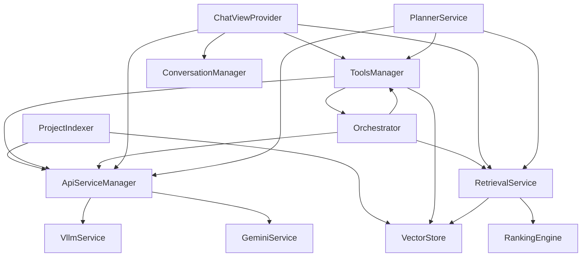

# 5. Servisler 🔧

İvme extension'ının kalbi, iyi organize edilmiş ve modüler bir servis mimarisinde yatar. Bu bölümde, extension'ın tüm servis katmanlarını, bunların nasıl çalıştığını ve birbirleriyle nasıl etkileşime girdiğini derinlemesine inceleyeceğiz.

## İçindekiler

- [5.1 API Service Manager](#51-api-service-manager)
- [5.2 vLLM Service](#52-vllm-service)
- [5.3 Gemini Service](#53-gemini-service)
- [5.4 Vector Store Service](#54-vector-store-service)
- [5.5 Project Indexer Service](#55-project-indexer-service)
- [5.6 Tools Manager Service](#56-tools-manager-service)
- [5.7 Orchestrator Service](#57-orchestrator-service)
- [5.8 Retrieval Service](#58-retrieval-service)
- [5.9 Servis Etkileşimleri](#59-servis-etkileşimleri)

---

## 5.1 API Service Manager

### 🎯 Genel Bakış

ApiServiceManager, İvme extension'ının farklı AI servislerini (vLLM ve Gemini) yönetmek için merkezi bir facade görevi görür. Bu servis, unified interface sağlayarak extension'ın geri kalanının hangi AI provider'ının kullanıldığından bağımsız olarak çalışmasını sağlar.

```typescript
interface IApiService {
  checkConnection(): Promise<boolean>;
  generateContent(prompt: string, options?: GenerationOptions): Promise<string>;
  generateChatContent(
    messages: ChatMessage[], 
    options?: ChatGenerationOptions
  ): Promise<string>;
  embedTextIfAvailable(text: string): Promise<number[] | null>;
  getContextLimitIfAvailable(): Promise<number | null>;
  countTokensIfAvailable(text: string): Promise<number | null>;
}
```

### 🏗️ Mimari ve Implementation

#### Core Service Manager
```typescript
class ApiServiceManager implements IApiService {
  private vllmService: VllmApiService;
  private geminiService: GeminiApiService;
  
  constructor(context: vscode.ExtensionContext) {
    this.vllmService = new VllmApiService(context);
    this.geminiService = new GeminiApiService(context);
  }
  
  /**
   * Aktif servisi belirler (kullanıcı ayarlarına göre)
   */
  private getActiveService(): IApiService {
    const config = vscode.workspace.getConfiguration();
    const activeServiceName = config.get<ApiServiceName>(SETTINGS_KEYS.ACTIVE_SERVICE);
    
    switch (activeServiceName) {
      case 'vllm':
        return this.vllmService;
      case 'gemini':
        return this.geminiService;
      default:
        throw new Error(`Unknown API service: ${activeServiceName}`);
    }
  }
  
  async checkConnection(): Promise<boolean> {
    try {
      const activeService = this.getActiveService();
      return await activeService.checkConnection();
    } catch (error) {
      console.error('Connection check failed:', error);
      return false;
    }
  }
  
  async generateContent(
    prompt: string, 
    options: GenerationOptions = {}
  ): Promise<string> {
    const activeService = this.getActiveService();
    
    // Add request logging
    console.log(`[ApiServiceManager] Generating content with ${this.getActiveServiceName()}`);
    
    const startTime = Date.now();
    try {
      const result = await activeService.generateContent(prompt, options);
      const duration = Date.now() - startTime;
      
      // Log success metrics
      console.log(`[ApiServiceManager] Content generated in ${duration}ms`);
      
      return result;
    } catch (error) {
      const duration = Date.now() - startTime;
      console.error(`[ApiServiceManager] Content generation failed after ${duration}ms:`, error);
      throw error;
    }
  }
  
  async generateChatContent(
    messages: ChatMessage[], 
    options: ChatGenerationOptions = {}
  ): Promise<string> {
    const activeService = this.getActiveService();
    
    // Validate messages
    if (!messages || messages.length === 0) {
      throw new Error('Messages array cannot be empty');
    }
    
    // Add conversation context logging
    console.log(`[ApiServiceManager] Chat generation with ${messages.length} messages`);
    
    try {
      const result = await activeService.generateChatContent(messages, options);
      return result;
    } catch (error) {
      console.error('[ApiServiceManager] Chat generation failed:', error);
      throw error;
    }
  }
}
```

#### Service Health Monitoring
```typescript
interface ServiceHealth {
  serviceName: string;
  isConnected: boolean;
  lastChecked: Date;
  responseTime: number;
  errorCount: number;
  lastError?: string;
}

class ServiceHealthMonitor {
  private healthStatus = new Map<string, ServiceHealth>();
  private checkInterval: NodeJS.Timeout | null = null;
  
  startMonitoring(services: IApiService[], intervalMs: number = 30000): void {
    this.checkInterval = setInterval(async () => {
      await this.checkAllServices(services);
    }, intervalMs);
  }
  
  stopMonitoring(): void {
    if (this.checkInterval) {
      clearInterval(this.checkInterval);
      this.checkInterval = null;
    }
  }
  
  private async checkAllServices(services: IApiService[]): Promise<void> {
    const checkPromises = services.map(service => this.checkService(service));
    await Promise.allSettled(checkPromises);
  }
  
  private async checkService(service: IApiService): Promise<void> {
    const serviceName = service.constructor.name;
    const startTime = Date.now();
    
    try {
      const isConnected = await service.checkConnection();
      const responseTime = Date.now() - startTime;
      
      this.healthStatus.set(serviceName, {
        serviceName,
        isConnected,
        lastChecked: new Date(),
        responseTime,
        errorCount: isConnected ? 0 : (this.healthStatus.get(serviceName)?.errorCount || 0) + 1
      });
      
    } catch (error) {
      const responseTime = Date.now() - startTime;
      const currentHealth = this.healthStatus.get(serviceName);
      
      this.healthStatus.set(serviceName, {
        serviceName,
        isConnected: false,
        lastChecked: new Date(),
        responseTime,
        errorCount: (currentHealth?.errorCount || 0) + 1,
        lastError: error.message
      });
    }
  }
  
  getHealthStatus(serviceName: string): ServiceHealth | undefined {
    return this.healthStatus.get(serviceName);
  }
  
  getAllHealthStatuses(): ServiceHealth[] {
    return Array.from(this.healthStatus.values());
  }
}
```

### ⚙️ Configuration Management

#### Dynamic Service Switching
```typescript
class ServiceSwitcher {
  private apiManager: ApiServiceManager;
  private statusBarItem: vscode.StatusBarItem;
  
  constructor(apiManager: ApiServiceManager) {
    this.apiManager = apiManager;
    this.setupStatusBar();
    this.setupConfigurationWatcher();
  }
  
  private setupStatusBar(): void {
    this.statusBarItem = vscode.window.createStatusBarItem(
      vscode.StatusBarAlignment.Right, 
      100
    );
    this.statusBarItem.command = 'ivme.switchApiService';
    this.updateStatusBar();
    this.statusBarItem.show();
  }
  
  private setupConfigurationWatcher(): void {
    vscode.workspace.onDidChangeConfiguration(event => {
      if (event.affectsConfiguration(SETTINGS_KEYS.ACTIVE_SERVICE)) {
        this.handleServiceChange();
      }
    });
  }
  
  private async handleServiceChange(): Promise<void> {
    const newService = this.apiManager.getActiveServiceName();
    
    // Update status bar
    this.updateStatusBar();
    
    // Check new service connection
    const isConnected = await this.apiManager.checkConnection();
    
    if (isConnected) {
      vscode.window.showInformationMessage(
        `Switched to ${newService.toUpperCase()} service successfully`
      );
    } else {
      vscode.window.showWarningMessage(
        `Switched to ${newService.toUpperCase()} but connection failed. Check your configuration.`
      );
    }
  }
  
  private updateStatusBar(): void {
    const serviceName = this.apiManager.getActiveServiceName();
    this.statusBarItem.text = `$(brain) ${serviceName.toUpperCase()}`;
    this.statusBarItem.tooltip = `Active AI Service: ${serviceName}`;
  }
  
  async showServiceSwitchQuickPick(): Promise<void> {
    const items: vscode.QuickPickItem[] = [
      {
        label: 'vLLM',
        description: 'Local LLM server',
        detail: 'Use local vLLM server for inference'
      },
      {
        label: 'Gemini',
        description: 'Google Gemini API',
        detail: 'Use Google Gemini for cloud-based inference'
      }
    ];
    
    const selected = await vscode.window.showQuickPick(items, {
      placeHolder: 'Select AI Service',
      title: 'Switch AI Service Provider'
    });
    
    if (selected) {
      const serviceName = selected.label.toLowerCase() as ApiServiceName;
      await this.switchService(serviceName);
    }
  }
  
  private async switchService(serviceName: ApiServiceName): Promise<void> {
    const config = vscode.workspace.getConfiguration();
    await config.update(
      SETTINGS_KEYS.ACTIVE_SERVICE, 
      serviceName, 
      vscode.ConfigurationTarget.Workspace
    );
  }
}
```

---

## 5.2 vLLM Service

### 🚀 Genel Bakış

VllmApiService, local olarak çalışan vLLM server'ları ile iletişim kurmak için tasarlanmış specialized bir servistir. Bu servis, self-hosted LLM'ler için optimize edilmiş özellikleri ve performans ayarlamalarını içerir.

```typescript
interface VllmConfig {
  baseUrl: string;
  modelName: string;
  embeddingModelName: string;
  timeout: number;
  maxRetries: number;
  temperature: number;
  maxTokens: number;
  streamingChunkSize: number;
}
```

### 🔧 Core Implementation

#### Connection Management
```typescript
class VllmApiService implements IApiService {
  private config: VllmConfig;
  private httpClient: AxiosInstance;
  
  constructor(context: vscode.ExtensionContext) {
    this.loadConfiguration();
    this.setupHttpClient();
    this.setupConfigurationWatcher();
  }
  
  private loadConfiguration(): void {
    const config = vscode.workspace.getConfiguration();
    
    this.config = {
      baseUrl: config.get<string>(SETTINGS_KEYS.VLLM_BASE_URL) || 'http://localhost:8000',
      modelName: config.get<string>(SETTINGS_KEYS.VLLM_MODEL_NAME) || 'default',
      embeddingModelName: config.get<string>(SETTINGS_KEYS.VLLM_EMBEDDING_MODEL_NAME) || 'sentence-transformers/all-MiniLM-L6-v2',
      timeout: config.get<number>(SETTINGS_KEYS.VLLM_TIMEOUT) || 120000,
      maxRetries: config.get<number>(SETTINGS_KEYS.VLLM_MAX_RETRIES) || 3,
      temperature: config.get<number>(SETTINGS_KEYS.VLLM_TEMPERATURE) || 0.7,
      maxTokens: config.get<number>(SETTINGS_KEYS.VLLM_MAX_TOKENS) || 4096,
      streamingChunkSize: config.get<number>(SETTINGS_KEYS.VLLM_STREAMING_CHUNK_SIZE) || 1024
    };
  }
  
  private setupHttpClient(): void {
    this.httpClient = axios.create({
      baseURL: this.config.baseUrl,
      timeout: this.config.timeout,
      headers: {
        'Content-Type': 'application/json',
        'User-Agent': 'ivme-extension/1.0.0'
      }
    });
    
    // Request interceptor for logging
    this.httpClient.interceptors.request.use(request => {
      console.log(`[vLLM] ${request.method?.toUpperCase()} ${request.url}`);
      return request;
    });
    
    // Response interceptor for error handling
    this.httpClient.interceptors.response.use(
      response => response,
      async error => {
        if (error.response?.status === 503 && this.config.maxRetries > 0) {
          return this.handleServiceUnavailable(error);
        }
        throw error;
      }
    );
  }
  
  private async handleServiceUnavailable(error: any): Promise<any> {
    console.log('[vLLM] Service unavailable, implementing backoff strategy...');
    
    for (let attempt = 1; attempt <= this.config.maxRetries; attempt++) {
      const delay = Math.min(1000 * Math.pow(2, attempt), 10000);
      
      console.log(`[vLLM] Retry attempt ${attempt}/${this.config.maxRetries} in ${delay}ms`);
      
      await new Promise(resolve => setTimeout(resolve, delay));
      
      try {
        return await this.httpClient.request(error.config);
      } catch (retryError) {
        if (attempt === this.config.maxRetries) {
          throw retryError;
        }
      }
    }
  }
}
```

#### Text Generation
```typescript
// Text generation implementation
async generateContent(
  prompt: string, 
  options: GenerationOptions = {}
): Promise<string> {
  const requestBody = {
    model: this.config.modelName,
    prompt: prompt,
    max_tokens: options.maxTokens || this.config.maxTokens,
    temperature: options.temperature ?? this.config.temperature,
    top_p: options.topP || 0.9,
    frequency_penalty: options.frequencyPenalty || 0,
    presence_penalty: options.presencePenalty || 0,
    stop: options.stopSequences || []
  };
  
  try {
    const response = await this.httpClient.post('/v1/completions', requestBody);
    
    if (!response.data?.choices?.[0]?.text) {
      throw new Error('Invalid response format from vLLM server');
    }
    
    return response.data.choices[0].text.trim();
    
  } catch (error) {
    console.error('[vLLM] Content generation failed:', error);
    throw new Error(`vLLM generation failed: ${error.message}`);
  }
}

// Chat completion with streaming support
async generateChatContent(
  messages: ChatMessage[], 
  options: ChatGenerationOptions = {}
): Promise<string> {
  const requestBody = {
    model: this.config.modelName,
    messages: messages.map(msg => ({
      role: msg.role,
      content: msg.content
    })),
    max_tokens: options.maxTokens || this.config.maxTokens,
    temperature: options.temperature ?? this.config.temperature,
    stream: options.streaming || false,
    tools: options.tools || undefined
  };
  
  if (options.streaming && options.onChunk) {
    return this.generateChatContentStreaming(requestBody, options.onChunk);
  } else {
    return this.generateChatContentStandard(requestBody);
  }
}

private async generateChatContentStreaming(
  requestBody: any,
  onChunk: (chunk: string) => void
): Promise<string> {
  const response = await this.httpClient.post('/v1/chat/completions', 
    { ...requestBody, stream: true },
    { 
      responseType: 'stream',
      timeout: 0 // Disable timeout for streaming
    }
  );
  
  let fullContent = '';
  
  return new Promise((resolve, reject) => {
    response.data.on('data', (chunk: Buffer) => {
      const lines = chunk.toString().split('\n');
      
      for (const line of lines) {
        if (line.startsWith('data: ')) {
          const data = line.slice(6).trim();
          
          if (data === '[DONE]') {
            resolve(fullContent);
            return;
          }
          
          try {
            const parsed = JSON.parse(data);
            const content = parsed.choices?.[0]?.delta?.content;
            
            if (content) {
              fullContent += content;
              onChunk(content);
            }
          } catch (parseError) {
            // Ignore parsing errors for partial chunks
          }
        }
      }
    });
    
    response.data.on('error', (error: any) => {
      reject(new Error(`Streaming error: ${error.message}`));
    });
    
    response.data.on('end', () => {
      resolve(fullContent);
    });
  });
}
```

#### Embedding Generation
```typescript
async embedText(text: string): Promise<number[]> {
  if (!text || text.trim().length === 0) {
    throw new Error('Text cannot be empty for embedding');
  }
  
  // Truncate text if too long
  const maxLength = 8192; // Most embedding models have token limits
  const truncatedText = text.length > maxLength ? 
    text.substring(0, maxLength) + '...' : text;
  
  const requestBody = {
    model: this.config.embeddingModelName,
    input: truncatedText
  };
  
  try {
    const response = await this.httpClient.post('/v1/embeddings', requestBody);
    
    if (!response.data?.data?.[0]?.embedding) {
      throw new Error('Invalid embedding response format');
    }
    
    const embedding = response.data.data[0].embedding;
    
    // Validate embedding
    if (!Array.isArray(embedding) || embedding.length === 0) {
      throw new Error('Invalid embedding format');
    }
    
    // Normalize embedding vector
    const normalized = this.normalizeVector(embedding);
    
    console.log(`[vLLM] Generated embedding of dimension ${normalized.length}`);
    
    return normalized;
    
  } catch (error) {
    console.error('[vLLM] Embedding generation failed:', error);
    throw new Error(`vLLM embedding failed: ${error.message}`);
  }
}

private normalizeVector(vector: number[]): number[] {
  const magnitude = Math.sqrt(vector.reduce((sum, val) => sum + val * val, 0));
  
  if (magnitude === 0) {
    return vector; // Avoid division by zero
  }
  
  return vector.map(val => val / magnitude);
}
```

#### Model Information and Capabilities
```typescript
async getModelInfo(): Promise<VllmModelInfo> {
  try {
    const response = await this.httpClient.get('/v1/models');
    
    const models = response.data?.data || [];
    const currentModel = models.find(m => m.id === this.config.modelName);
    
    if (!currentModel) {
      throw new Error(`Model ${this.config.modelName} not found`);
    }
    
    return {
      id: currentModel.id,
      object: currentModel.object,
      created: currentModel.created,
      ownedBy: currentModel.owned_by,
      capabilities: {
        completion: true,
        chat: true,
        embedding: currentModel.id === this.config.embeddingModelName,
        streaming: true,
        toolCalling: this.supportsToolCalling(currentModel)
      },
      contextLength: await this.getModelContextLimit(),
      maxTokens: this.config.maxTokens
    };
    
  } catch (error) {
    console.error('[vLLM] Failed to get model info:', error);
    throw error;
  }
}

private supportsToolCalling(modelInfo: any): boolean {
  // Check if model supports function calling
  // This is a heuristic as vLLM doesn't always expose this info
  const toolCapableModels = [
    'codellama',
    'mistral',
    'mixtral',
    'llama-2-chat',
    'vicuna'
  ];
  
  return toolCapableModels.some(model => 
    modelInfo.id.toLowerCase().includes(model)
  );
}

async getModelContextLimit(): Promise<number> {
  try {
    // Try to get context limit from model endpoint
    const response = await this.httpClient.get(`/v1/models/${this.config.modelName}`);
    
    if (response.data?.context_length) {
      return response.data.context_length;
    }
    
    // Fallback to common model context limits
    const contextLimits = {
      'llama-2-7b': 4096,
      'llama-2-13b': 4096,
      'llama-2-70b': 4096,
      'codellama': 16384,
      'mistral-7b': 8192,
      'mixtral-8x7b': 32768,
      'vicuna': 2048
    };
    
    const modelLower = this.config.modelName.toLowerCase();
    for (const [modelPrefix, limit] of Object.entries(contextLimits)) {
      if (modelLower.includes(modelPrefix)) {
        return limit;
      }
    }
    
    // Default context limit
    return 4096;
    
  } catch (error) {
    console.warn('[vLLM] Could not determine context limit, using default');
    return 4096;
  }
}
```

---

## 5.3 Gemini Service

### 🌟 Genel Bakış

GeminiApiService, Google'ın Gemini AI model'lerini kullanmak için tasarlanmış cloud-based bir servistir. Bu servis, Google AI Studio API'sini kullanarak yüksek kaliteli text generation, embedding ve multimodal capabilities sağlar.

```typescript
interface GeminiConfig {
  apiKey: string;
  modelName: string;
  embeddingModel: string;
  maxTokens: number;
  temperature: number;
  topP: number;
  topK: number;
  timeout: number;
  safetySettings: SafetySetting[];
}
```

### 🔧 Core Implementation

#### Client Initialization
```typescript
class GeminiApiService implements IApiService {
  private genAI: GoogleGenerativeAI | null = null;
  private config: GeminiConfig;
  private modelCache = new Map<string, GenerativeModel>();
  
  constructor(private context: vscode.ExtensionContext) {
    this.loadConfiguration();
    this.initializeClient();
    this.setupConfigurationWatcher();
  }
  
  private async loadConfiguration(): Promise<void> {
    const config = vscode.workspace.getConfiguration();
    
    // Get API key from secure storage
    const apiKey = await this.context.secrets.get('gemini.apiKey') || 
                   config.get<string>(SETTINGS_KEYS.GEMINI_API_KEY) || '';
    
    this.config = {
      apiKey,
      modelName: config.get<string>(SETTINGS_KEYS.GEMINI_MODEL_NAME) || 'gemini-1.5-flash',
      embeddingModel: config.get<string>(SETTINGS_KEYS.GEMINI_EMBEDDING_MODEL) || 'text-embedding-004',
      maxTokens: config.get<number>(SETTINGS_KEYS.GEMINI_MAX_TOKENS) || 8192,
      temperature: config.get<number>(SETTINGS_KEYS.GEMINI_TEMPERATURE) || 0.7,
      topP: config.get<number>(SETTINGS_KEYS.GEMINI_TOP_P) || 0.8,
      topK: config.get<number>(SETTINGS_KEYS.GEMINI_TOP_K) || 40,
      timeout: config.get<number>(SETTINGS_KEYS.GEMINI_TIMEOUT) || 60000,
      safetySettings: this.getDefaultSafetySettings()
    };
  }
  
  private getDefaultSafetySettings(): SafetySetting[] {
    return [
      {
        category: HarmCategory.HARM_CATEGORY_HARASSMENT,
        threshold: HarmBlockThreshold.BLOCK_ONLY_HIGH
      },
      {
        category: HarmCategory.HARM_CATEGORY_HATE_SPEECH,
        threshold: HarmBlockThreshold.BLOCK_ONLY_HIGH
      },
      {
        category: HarmCategory.HARM_CATEGORY_SEXUALLY_EXPLICIT,
        threshold: HarmBlockThreshold.BLOCK_ONLY_HIGH
      },
      {
        category: HarmCategory.HARM_CATEGORY_DANGEROUS_CONTENT,
        threshold: HarmBlockThreshold.BLOCK_ONLY_HIGH
      }
    ];
  }
  
  private initializeClient(): void {
    if (!this.config.apiKey) {
      console.warn('[Gemini] API key not configured');
      return;
    }
    
    try {
      this.genAI = new GoogleGenerativeAI(this.config.apiKey);
      console.log('[Gemini] Client initialized successfully');
    } catch (error) {
      console.error('[Gemini] Failed to initialize client:', error);
      this.genAI = null;
    }
  }
  
  private getOrCreateModel(modelName: string): GenerativeModel {
    if (!this.genAI) {
      throw new Error('Gemini client not initialized. Please check your API key.');
    }
    
    if (this.modelCache.has(modelName)) {
      return this.modelCache.get(modelName)!;
    }
    
    const model = this.genAI.getGenerativeModel({
      model: modelName,
      generationConfig: {
        temperature: this.config.temperature,
        topP: this.config.topP,
        topK: this.config.topK,
        maxOutputTokens: this.config.maxTokens
      },
      safetySettings: this.config.safetySettings
    });
    
    this.modelCache.set(modelName, model);
    return model;
  }
}
```

#### Text Generation
```typescript
async generateContent(
  prompt: string, 
  options: GenerationOptions = {}
): Promise<string> {
  if (!this.genAI) {
    throw new Error('Gemini service not initialized');
  }
  
  const model = this.getOrCreateModel(options.modelName || this.config.modelName);
  
  try {
    console.log('[Gemini] Generating content...');
    
    const result = await model.generateContent({
      contents: [{ role: 'user', parts: [{ text: prompt }] }],
      generationConfig: {
        temperature: options.temperature ?? this.config.temperature,
        topP: options.topP ?? this.config.topP,
        topK: options.topK ?? this.config.topK,
        maxOutputTokens: options.maxTokens ?? this.config.maxTokens,
        stopSequences: options.stopSequences
      }
    });
    
    const response = await result.response;
    const text = response.text();
    
    if (!text) {
      throw new Error('Empty response from Gemini');
    }
    
    console.log(`[Gemini] Generated ${text.length} characters`);
    return text;
    
  } catch (error) {
    console.error('[Gemini] Content generation failed:', error);
    
    if (error.message?.includes('API_KEY_INVALID')) {
      throw new Error('Invalid Gemini API key. Please check your configuration.');
    }
    
    if (error.message?.includes('QUOTA_EXCEEDED')) {
      throw new Error('Gemini API quota exceeded. Please check your usage limits.');
    }
    
    if (error.message?.includes('SAFETY')) {
      throw new Error('Content was blocked by Gemini safety filters. Try rephrasing your request.');
    }
    
    throw new Error(`Gemini generation failed: ${error.message}`);
  }
}

async generateChatContent(
  messages: ChatMessage[], 
  options: ChatGenerationOptions = {}
): Promise<string> {
  if (!this.genAI) {
    throw new Error('Gemini service not initialized');
  }
  
  const model = this.getOrCreateModel(options.modelName || this.config.modelName);
  
  try {
    // Convert messages to Gemini format
    const contents = this.convertMessagesToGeminiFormat(messages);
    
    if (options.streaming && options.onChunk) {
      return await this.generateChatContentStreaming(model, contents, options);
    } else {
      return await this.generateChatContentStandard(model, contents, options);
    }
    
  } catch (error) {
    console.error('[Gemini] Chat generation failed:', error);
    throw new Error(`Gemini chat generation failed: ${error.message}`);
  }
}

private convertMessagesToGeminiFormat(messages: ChatMessage[]): Content[] {
  const contents: Content[] = [];
  
  for (const message of messages) {
    // Handle system messages by converting to user context
    if (message.role === 'system') {
      contents.push({
        role: 'user',
        parts: [{ text: `System Context: ${message.content}` }]
      });
      continue;
    }
    
    // Map roles
    const role = message.role === 'assistant' ? 'model' : 'user';
    
    contents.push({
      role,
      parts: [{ text: message.content }]
    });
  }
  
  return contents;
}

private async generateChatContentStreaming(
  model: GenerativeModel,
  contents: Content[],
  options: ChatGenerationOptions
): Promise<string> {
  const result = await model.generateContentStream({
    contents,
    generationConfig: {
      temperature: options.temperature ?? this.config.temperature,
      topP: options.topP ?? this.config.topP,
      topK: options.topK ?? this.config.topK,
      maxOutputTokens: options.maxTokens ?? this.config.maxTokens
    }
  });
  
  let fullText = '';
  
  for await (const chunk of result.stream) {
    const chunkText = chunk.text();
    if (chunkText) {
      fullText += chunkText;
      options.onChunk?.(chunkText);
    }
  }
  
  return fullText;
}
```

#### Embedding Generation
```typescript
async embedText(text: string): Promise<number[]> {
  if (!this.genAI) {
    throw new Error('Gemini service not initialized');
  }
  
  if (!text || text.trim().length === 0) {
    throw new Error('Text cannot be empty for embedding');
  }
  
  try {
    // Use dedicated embedding model
    const model = this.genAI.getGenerativeModel({ 
      model: this.config.embeddingModel 
    });
    
    console.log(`[Gemini] Generating embedding for ${text.length} characters`);
    
    const result = await model.embedContent(text);
    
    if (!result.embedding?.values || result.embedding.values.length === 0) {
      throw new Error('Invalid embedding response from Gemini');
    }
    
    const embedding = result.embedding.values;
    
    console.log(`[Gemini] Generated embedding of dimension ${embedding.length}`);
    
    return embedding;
    
  } catch (error) {
    console.error('[Gemini] Embedding generation failed:', error);
    
    if (error.message?.includes('API_KEY_INVALID')) {
      throw new Error('Invalid Gemini API key for embedding service');
    }
    
    throw new Error(`Gemini embedding failed: ${error.message}`);
  }
}

async batchEmbedTexts(texts: string[]): Promise<number[][]> {
  if (!this.genAI) {
    throw new Error('Gemini service not initialized');
  }
  
  if (!texts || texts.length === 0) {
    return [];
  }
  
  // Filter out empty texts
  const validTexts = texts.filter(text => text && text.trim().length > 0);
  
  if (validTexts.length === 0) {
    return [];
  }
  
  try {
    const model = this.genAI.getGenerativeModel({ 
      model: this.config.embeddingModel 
    });
    
    console.log(`[Gemini] Batch embedding ${validTexts.length} texts`);
    
    // Process in batches to avoid rate limits
    const batchSize = 10;
    const results: number[][] = [];
    
    for (let i = 0; i < validTexts.length; i += batchSize) {
      const batch = validTexts.slice(i, i + batchSize);
      const batchPromises = batch.map(text => model.embedContent(text));
      
      const batchResults = await Promise.allSettled(batchPromises);
      
      for (const result of batchResults) {
        if (result.status === 'fulfilled' && result.value.embedding?.values) {
          results.push(result.value.embedding.values);
        } else {
          console.warn('[Gemini] Failed to embed one text in batch:', 
            result.status === 'rejected' ? result.reason : 'Invalid response');
          results.push([]); // Empty embedding for failed text
        }
      }
      
      // Rate limiting delay between batches
      if (i + batchSize < validTexts.length) {
        await new Promise(resolve => setTimeout(resolve, 1000));
      }
    }
    
    console.log(`[Gemini] Batch embedding completed: ${results.length} embeddings`);
    
    return results;
    
  } catch (error) {
    console.error('[Gemini] Batch embedding failed:', error);
    throw new Error(`Gemini batch embedding failed: ${error.message}`);
  }
}
```

#### Token Counting and Model Information
```typescript
async countTokens(text: string): Promise<number> {
  if (!this.genAI) {
    throw new Error('Gemini service not initialized');
  }
  
  try {
    const model = this.getOrCreateModel(this.config.modelName);
    
    const result = await model.countTokens({
      contents: [{ role: 'user', parts: [{ text }] }]
    });
    
    return result.totalTokens;
    
  } catch (error) {
    console.warn('[Gemini] Token counting failed, using estimation:', error);
    
    // Fallback to rough estimation (4 characters per token)
    return Math.ceil(text.length / 4);
  }
}

async getModelContextLimit(): Promise<number> {
  // Gemini model context limits
  const contextLimits = {
    'gemini-1.5-pro': 2097152,    // 2M tokens
    'gemini-1.5-flash': 1048576,  // 1M tokens
    'gemini-1.0-pro': 32768,     // 32K tokens
    'gemini-pro': 32768,         // 32K tokens
    'text-embedding-004': 2048   // 2K tokens for embedding
  };
  
  const modelName = this.config.modelName.toLowerCase();
  
  for (const [model, limit] of Object.entries(contextLimits)) {
    if (modelName.includes(model)) {
      return limit;
    }
  }
  
  // Default limit
  return 32768;
}

async checkConnection(): Promise<boolean> {
  if (!this.genAI) {
    return false;
  }
  
  try {
    // Simple test generation to verify connection
    const model = this.getOrCreateModel(this.config.modelName);
    
    const result = await model.generateContent({
      contents: [{ role: 'user', parts: [{ text: 'Hello' }] }],
      generationConfig: {
        maxOutputTokens: 10,
        temperature: 0
      }
    });
    
    const response = await result.response;
    const text = response.text();
    
    return text.length > 0;
    
  } catch (error) {
    console.error('[Gemini] Connection check failed:', error);
    return false;
  }
}
```

#### Error Handling and Rate Limiting
```typescript
class GeminiRateLimiter {
  private requestCount = 0;
  private windowStart = Date.now();
  private readonly windowSize = 60000; // 1 minute
  private readonly maxRequests = 60;   // 60 requests per minute
  
  async waitForRateLimit(): Promise<void> {
    const now = Date.now();
    
    // Reset window if needed
    if (now - this.windowStart >= this.windowSize) {
      this.requestCount = 0;
      this.windowStart = now;
    }
    
    // Check if we need to wait
    if (this.requestCount >= this.maxRequests) {
      const waitTime = this.windowSize - (now - this.windowStart);
      console.log(`[Gemini] Rate limit reached, waiting ${waitTime}ms`);
      
      await new Promise(resolve => setTimeout(resolve, waitTime));
      
      // Reset after waiting
      this.requestCount = 0;
      this.windowStart = Date.now();
    }
    
    this.requestCount++;
  }
}

class GeminiErrorHandler {
  static handleError(error: any): Error {
    const message = error.message || error.toString();
    
    if (message.includes('API_KEY_INVALID') || message.includes('401')) {
      return new Error('Invalid Gemini API key. Please verify your API key in settings.');
    }
    
    if (message.includes('QUOTA_EXCEEDED') || message.includes('429')) {
      return new Error('Gemini API quota exceeded. Please check your usage limits or try again later.');
    }
    
    if (message.includes('SAFETY') || message.includes('BLOCKED')) {
      return new Error('Content was blocked by Gemini safety filters. Please rephrase your request.');
    }
    
    if (message.includes('INVALID_ARGUMENT') || message.includes('400')) {
      return new Error('Invalid request format. Please check your input and try again.');
    }
    
    if (message.includes('SERVICE_UNAVAILABLE') || message.includes('503')) {
      return new Error('Gemini service is temporarily unavailable. Please try again later.');
    }
    
    if (message.includes('DEADLINE_EXCEEDED') || message.includes('timeout')) {
      return new Error('Request timed out. Please try again with a shorter input.');
    }
    
    return new Error(`Gemini API error: ${message}`);
  }
}
```

---

## 5.4 Vector Store Service

### 🗄️ Genel Bakış

Vector Store Service, kod chunk'larının semantic embedding'lerini depolamak ve aramak için tasarlanmış özelleştirilmiş bir veri yönetim sistemidir. Bu servis, high-performance similarity search ve efficient storage management sağlar.

```typescript
interface VectorStoreSchema {
  version: string;
  metadata: StoreMetadata;
  chunks: CodeChunkMetadata[];
  indexes: {
    fileIndex: Map<string, string[]>;     // file -> chunk IDs
    typeIndex: Map<string, string[]>;     // type -> chunk IDs
    nameIndex: Map<string, string[]>;     // name -> chunk IDs
    tagIndex: Map<string, string[]>;      // tag -> chunk IDs
  };
  embeddings: Map<string, number[]>;      // chunk ID -> embedding
}
```

### 🏗️ Core Implementation

#### Storage Management
```typescript
class VectorStore {
  private data: VectorStoreSchema;
  private filePath: string;
  private isDirty: boolean = false;
  private saveTimer: NodeJS.Timeout | null = null;
  private compressionEnabled: boolean = true;
  
  constructor(private context: vscode.ExtensionContext) {
    this.filePath = this.getStorePath();
    this.initializeStore();
    this.setupAutoSave();
  }
  
  private getStorePath(): string {
    const workspaceFolder = vscode.workspace.workspaceFolders?.[0];
    if (!workspaceFolder) {
      throw new Error('No workspace folder found');
    }
    
    const ivmeDir = path.join(workspaceFolder.uri.fsPath, '.ivme');
    
    // Ensure directory exists
    if (!fs.existsSync(ivmeDir)) {
      fs.mkdirSync(ivmeDir, { recursive: true });
    }
    
    return path.join(ivmeDir, 'vector_store.json');
  }
  
  private async initializeStore(): Promise<void> {
    try {
      if (fs.existsSync(this.filePath)) {
        await this.loadFromDisk();
      } else {
        this.createEmptyStore();
      }
    } catch (error) {
      console.error('[VectorStore] Failed to initialize store:', error);
      this.createEmptyStore();
    }
  }
  
  private createEmptyStore(): void {
    this.data = {
      version: '1.0.0',
      metadata: {
        created: new Date(),
        lastUpdated: new Date(),
        totalChunks: 0,
        totalFiles: 0,
        storageSize: 0,
        embeddingDimension: 0
      },
      chunks: [],
      indexes: {
        fileIndex: new Map(),
        typeIndex: new Map(),
        nameIndex: new Map(),
        tagIndex: new Map()
      },
      embeddings: new Map()
    };
  }
  
  private async loadFromDisk(): Promise<void> {
    try {
      const rawData = fs.readFileSync(this.filePath, 'utf-8');
      const parsed = JSON.parse(rawData);
      
      // Convert Maps from JSON
      this.data = {
        ...parsed,
        indexes: {
          fileIndex: new Map(parsed.indexes?.fileIndex || []),
          typeIndex: new Map(parsed.indexes?.typeIndex || []),
          nameIndex: new Map(parsed.indexes?.nameIndex || []),
          tagIndex: new Map(parsed.indexes?.tagIndex || [])
        },
        embeddings: new Map(parsed.embeddings || [])
      };
      
      console.log(`[VectorStore] Loaded ${this.data.chunks.length} chunks from disk`);
      
    } catch (error) {
      console.error('[VectorStore] Failed to load from disk:', error);
      this.createEmptyStore();
    }
  }
  
  private setupAutoSave(): void {
    // Save every 30 seconds if dirty
    setInterval(() => {
      if (this.isDirty) {
        this.saveToDisk();
      }
    }, 30000);
    
    // Save on process exit
    process.on('exit', () => {
      if (this.isDirty) {
        this.saveToDiskSync();
      }
    });
  }
}
```

#### Chunk Management
```typescript
async addChunk(chunk: CodeChunkMetadata, embedding?: number[]): Promise<void> {
  try {
    // Validate chunk
    if (!chunk.id || !chunk.name || !chunk.filePath) {
      throw new Error('Invalid chunk: missing required fields');
    }
    
    // Check for duplicates
    const existingIndex = this.data.chunks.findIndex(c => c.id === chunk.id);
    
    if (existingIndex >= 0) {
      // Update existing chunk
      this.data.chunks[existingIndex] = chunk;
      console.log(`[VectorStore] Updated chunk: ${chunk.id}`);
    } else {
      // Add new chunk
      this.data.chunks.push(chunk);
      this.data.metadata.totalChunks++;
      console.log(`[VectorStore] Added chunk: ${chunk.id}`);
    }
    
    // Store embedding if provided
    if (embedding && embedding.length > 0) {
      this.data.embeddings.set(chunk.id, embedding);
      
      // Update embedding dimension
      if (this.data.metadata.embeddingDimension === 0) {
        this.data.metadata.embeddingDimension = embedding.length;
      }
    }
    
    // Update indexes
    this.updateIndexes(chunk);
    
    // Update metadata
    this.data.metadata.lastUpdated = new Date();
    this.markDirty();
    
  } catch (error) {
    console.error('[VectorStore] Failed to add chunk:', error);
    throw error;
  }
}

private updateIndexes(chunk: CodeChunkMetadata): void {
  // File index
  if (!this.data.indexes.fileIndex.has(chunk.filePath)) {
    this.data.indexes.fileIndex.set(chunk.filePath, []);
  }
  
  const fileChunks = this.data.indexes.fileIndex.get(chunk.filePath)!;
  if (!fileChunks.includes(chunk.id)) {
    fileChunks.push(chunk.id);
  }
  
  // Type index
  if (chunk.contentType) {
    if (!this.data.indexes.typeIndex.has(chunk.contentType)) {
      this.data.indexes.typeIndex.set(chunk.contentType, []);
    }
    
    const typeChunks = this.data.indexes.typeIndex.get(chunk.contentType)!;
    if (!typeChunks.includes(chunk.id)) {
      typeChunks.push(chunk.id);
    }
  }
  
  // Name index
  const nameLower = chunk.name.toLowerCase();
  if (!this.data.indexes.nameIndex.has(nameLower)) {
    this.data.indexes.nameIndex.set(nameLower, []);
  }
  
  const nameChunks = this.data.indexes.nameIndex.get(nameLower)!;
  if (!nameChunks.includes(chunk.id)) {
    nameChunks.push(chunk.id);
  }
  
  // Tag index
  if (chunk.tags) {
    for (const tag of chunk.tags) {
      if (!this.data.indexes.tagIndex.has(tag)) {
        this.data.indexes.tagIndex.set(tag, []);
      }
      
      const tagChunks = this.data.indexes.tagIndex.get(tag)!;
      if (!tagChunks.includes(chunk.id)) {
        tagChunks.push(chunk.id);
      }
    }
  }
}

async removeChunk(chunkId: string): Promise<boolean> {
  try {
    const chunkIndex = this.data.chunks.findIndex(c => c.id === chunkId);
    
    if (chunkIndex === -1) {
      return false;
    }
    
    const chunk = this.data.chunks[chunkIndex];
    
    // Remove from chunks array
    this.data.chunks.splice(chunkIndex, 1);
    this.data.metadata.totalChunks--;
    
    // Remove embedding
    this.data.embeddings.delete(chunkId);
    
    // Update indexes
    this.removeFromIndexes(chunk);
    
    // Update metadata
    this.data.metadata.lastUpdated = new Date();
    this.markDirty();
    
    console.log(`[VectorStore] Removed chunk: ${chunkId}`);
    return true;
    
  } catch (error) {
    console.error('[VectorStore] Failed to remove chunk:', error);
    return false;
  }
}

async removeChunksByFile(filePath: string): Promise<number> {
  try {
    const chunkIds = this.data.indexes.fileIndex.get(filePath) || [];
    let removedCount = 0;
    
    for (const chunkId of chunkIds) {
      if (await this.removeChunk(chunkId)) {
        removedCount++;
      }
    }
    
    // Clean up file index
    this.data.indexes.fileIndex.delete(filePath);
    
    console.log(`[VectorStore] Removed ${removedCount} chunks from file: ${filePath}`);
    return removedCount;
    
  } catch (error) {
    console.error('[VectorStore] Failed to remove chunks by file:', error);
    return 0;
  }
}
```

#### Similarity Search
```typescript
async searchSimilar(
  queryEmbedding: number[],
  options: SearchOptions = {}
): Promise<SearchResult[]> {
  const {
    topK = 10,
    threshold = 0.0,
    filters = {},
    includeMetadata = true
  } = options;
  
  try {
    // Get candidate chunks based on filters
    let candidates = this.getCandidateChunks(filters);
    
    if (candidates.length === 0) {
      return [];
    }
    
    // Calculate similarities
    const similarities: Array<{
      chunk: CodeChunkMetadata;
      similarity: number;
      embedding: number[];
    }> = [];
    
    for (const chunk of candidates) {
      const chunkEmbedding = this.data.embeddings.get(chunk.id);
      
      if (!chunkEmbedding || chunkEmbedding.length === 0) {
        continue; // Skip chunks without embeddings
      }
      
      const similarity = this.cosineSimilarity(queryEmbedding, chunkEmbedding);
      
      if (similarity >= threshold) {
        similarities.push({
          chunk,
          similarity,
          embedding: chunkEmbedding
        });
      }
    }
    
    // Sort by similarity (descending) and take top K
    similarities.sort((a, b) => b.similarity - a.similarity);
    const topResults = similarities.slice(0, topK);
    
    // Convert to SearchResult objects
    const results: SearchResult[] = topResults.map(result => ({
      chunk: result.chunk,
      similarity: result.similarity,
      metadata: includeMetadata ? {
        embeddingDimension: result.embedding.length,
        indexedAt: this.data.metadata.lastUpdated,
        storeVersion: this.data.version
      } : undefined
    }));
    
    console.log(`[VectorStore] Found ${results.length} similar chunks (threshold: ${threshold})`);
    
    return results;
    
  } catch (error) {
    console.error('[VectorStore] Similarity search failed:', error);
    throw error;
  }
}

private getCandidateChunks(filters: SearchFilters): CodeChunkMetadata[] {
  let candidates = this.data.chunks;
  
  // Apply file filter
  if (filters.files && filters.files.length > 0) {
    const fileChunkIds = new Set<string>();
    
    for (const file of filters.files) {
      const chunkIds = this.data.indexes.fileIndex.get(file) || [];
      chunkIds.forEach(id => fileChunkIds.add(id));
    }
    
    candidates = candidates.filter(chunk => fileChunkIds.has(chunk.id));
  }
  
  // Apply type filter
  if (filters.contentTypes && filters.contentTypes.length > 0) {
    const typeChunkIds = new Set<string>();
    
    for (const type of filters.contentTypes) {
      const chunkIds = this.data.indexes.typeIndex.get(type) || [];
      chunkIds.forEach(id => typeChunkIds.add(id));
    }
    
    candidates = candidates.filter(chunk => typeChunkIds.has(chunk.id));
  }
  
  // Apply tag filter
  if (filters.tags && filters.tags.length > 0) {
    const tagChunkIds = new Set<string>();
    
    for (const tag of filters.tags) {
      const chunkIds = this.data.indexes.tagIndex.get(tag) || [];
      chunkIds.forEach(id => tagChunkIds.add(id));
    }
    
    candidates = candidates.filter(chunk => tagChunkIds.has(chunk.id));
  }
  
  // Apply date range filter
  if (filters.dateRange) {
    const { from, to } = filters.dateRange;
    
    candidates = candidates.filter(chunk => {
      const chunkDate = new Date(chunk.lastModified || chunk.createdAt || 0);
      return (!from || chunkDate >= from) && (!to || chunkDate <= to);
    });
  }
  
  return candidates;
}

private cosineSimilarity(a: number[], b: number[]): number {
  if (a.length !== b.length) {
    console.warn('[VectorStore] Embedding dimension mismatch');
    return 0;
  }
  
  if (a.length === 0) {
    return 0;
  }
  
  let dotProduct = 0;
  let normA = 0;
  let normB = 0;
  
  for (let i = 0; i < a.length; i++) {
    dotProduct += a[i] * b[i];
    normA += a[i] * a[i];
    normB += b[i] * b[i];
  }
  
  const denominator = Math.sqrt(normA) * Math.sqrt(normB);
  
  if (denominator === 0) {
    return 0;
  }
  
  return dotProduct / denominator;
}
```

#### Advanced Query Features
```typescript
async hybridSearch(
  query: string,
  queryEmbedding: number[],
  options: HybridSearchOptions = {}
): Promise<SearchResult[]> {
  const {
    embeddingWeight = 0.7,
    textWeight = 0.3,
    topK = 10,
    threshold = 0.0
  } = options;
  
  try {
    // 1. Semantic search with embeddings
    const semanticResults = await this.searchSimilar(queryEmbedding, {
      topK: topK * 2, // Get more candidates for hybrid scoring
      threshold: 0.0  // Lower threshold for combining
    });
    
    // 2. Text-based search (BM25-like scoring)
    const textResults = await this.textSearch(query, {
      topK: topK * 2,
      fuzzyMatching: true
    });
    
    // 3. Combine and re-rank results
    const combinedResults = this.combineSearchResults(
      semanticResults,
      textResults,
      embeddingWeight,
      textWeight
    );
    
    // 4. Apply final threshold and limit
    const finalResults = combinedResults
      .filter(result => result.similarity >= threshold)
      .slice(0, topK);
    
    console.log(`[VectorStore] Hybrid search: ${semanticResults.length} semantic + ${textResults.length} text = ${finalResults.length} final`);
    
    return finalResults;
    
  } catch (error) {
    console.error('[VectorStore] Hybrid search failed:', error);
    throw error;
  }
}

private async textSearch(
  query: string,
  options: TextSearchOptions = {}
): Promise<SearchResult[]> {
  const { topK = 10, fuzzyMatching = false } = options;
  
  const queryTerms = this.tokenizeQuery(query);
  const results: Array<{ chunk: CodeChunkMetadata; score: number }> = [];
  
  for (const chunk of this.data.chunks) {
    const score = this.calculateTextScore(chunk, queryTerms, fuzzyMatching);
    
    if (score > 0) {
      results.push({ chunk, score });
    }
  }
  
  // Sort by score and take top K
  results.sort((a, b) => b.score - a.score);
  
  return results.slice(0, topK).map(result => ({
    chunk: result.chunk,
    similarity: result.score,
    metadata: {
      searchType: 'text',
      matchedTerms: this.getMatchedTerms(result.chunk, queryTerms)
    }
  }));
}

private tokenizeQuery(query: string): string[] {
  return query
    .toLowerCase()
    .replace(/[^\w\s]/g, ' ')
    .split(/\s+/)
    .filter(term => term.length > 2);
}

private calculateTextScore(
  chunk: CodeChunkMetadata,
  queryTerms: string[],
  fuzzyMatching: boolean
): number {
  const text = `${chunk.name} ${chunk.summary || ''} ${chunk.content || ''}`.toLowerCase();
  
  let score = 0;
  
  for (const term of queryTerms) {
    // Exact match
    const exactMatches = (text.match(new RegExp(term, 'g')) || []).length;
    score += exactMatches * 2;
    
    // Fuzzy matching (if enabled)
    if (fuzzyMatching && exactMatches === 0) {
      const fuzzyScore = this.fuzzyMatch(term, text);
      score += fuzzyScore;
    }
  }
  
  // Boost score based on chunk type
  const typeBoosts = {
    'function': 1.5,
    'class': 1.3,
    'interface': 1.2,
    'method': 1.4
  };
  
  const boost = typeBoosts[chunk.contentType] || 1.0;
  
  return score * boost;
}

private fuzzyMatch(term: string, text: string): number {
  // Simple fuzzy matching using Levenshtein distance
  const words = text.split(/\s+/);
  let bestScore = 0;
  
  for (const word of words) {
    if (word.length < term.length - 2) continue;
    
    const distance = this.levenshteinDistance(term, word);
    const similarity = 1 - (distance / Math.max(term.length, word.length));
    
    if (similarity > 0.7) { // Threshold for fuzzy match
      bestScore = Math.max(bestScore, similarity * 0.5); // Lower weight for fuzzy matches
    }
  }
  
  return bestScore;
}

private levenshteinDistance(a: string, b: string): number {
  const matrix: number[][] = [];
  
  for (let i = 0; i <= b.length; i++) {
    matrix[i] = [i];
  }
  
  for (let j = 0; j <= a.length; j++) {
    matrix[0][j] = j;
  }
  
  for (let i = 1; i <= b.length; i++) {
    for (let j = 1; j <= a.length; j++) {
      if (b.charAt(i - 1) === a.charAt(j - 1)) {
        matrix[i][j] = matrix[i - 1][j - 1];
      } else {
        matrix[i][j] = Math.min(
          matrix[i - 1][j - 1] + 1,
          matrix[i][j - 1] + 1,
          matrix[i - 1][j] + 1
        );
      }
    }
  }
  
  return matrix[b.length][a.length];
}
```

#### Performance Optimization
```typescript
class VectorStoreOptimizer {
  private store: VectorStore;
  private performanceMetrics: PerformanceMetrics;
  
  constructor(store: VectorStore) {
    this.store = store;
    this.performanceMetrics = new PerformanceMetrics();
  }
  
  async optimizeStorage(): Promise<OptimizationResult> {
    const startTime = Date.now();
    
    try {
      // 1. Remove duplicate chunks
      const duplicatesRemoved = await this.removeDuplicates();
      
      // 2. Compact embeddings (remove unused)
      const embeddingsCompacted = await this.compactEmbeddings();
      
      // 3. Rebuild indexes
      await this.rebuildIndexes();
      
      // 4. Compress storage
      const compressionSaved = await this.compressStorage();
      
      const duration = Date.now() - startTime;
      
      const result: OptimizationResult = {
        duration,
        duplicatesRemoved,
        embeddingsCompacted,
        compressionSaved,
        newStorageSize: await this.getStorageSize()
      };
      
      console.log('[VectorStore] Optimization completed:', result);
      
      return result;
      
    } catch (error) {
      console.error('[VectorStore] Optimization failed:', error);
      throw error;
    }
  }
  
  private async removeDuplicates(): Promise<number> {
    const chunks = this.store.getAllChunks();
    const seen = new Set<string>();
    let removedCount = 0;
    
    for (const chunk of chunks) {
      // Create a hash of chunk content for deduplication
      const contentHash = this.hashChunkContent(chunk);
      
      if (seen.has(contentHash)) {
        await this.store.removeChunk(chunk.id);
        removedCount++;
      } else {
        seen.add(contentHash);
      }
    }
    
    return removedCount;
  }
  
  private hashChunkContent(chunk: CodeChunkMetadata): string {
    const content = `${chunk.filePath}:${chunk.startLine}:${chunk.endLine}:${chunk.content}`;
    
    // Simple hash function
    let hash = 0;
    for (let i = 0; i < content.length; i++) {
      const char = content.charCodeAt(i);
      hash = ((hash << 5) - hash) + char;
      hash = hash & hash; // Convert to 32-bit integer
    }
    
    return hash.toString(16);
  }
  
  private async compactEmbeddings(): Promise<number> {
    const allChunkIds = new Set(this.store.getAllChunks().map(c => c.id));
    const embeddingIds = new Set(this.store.getAllEmbeddingIds());
    
    let removedCount = 0;
    
    // Remove embeddings for non-existent chunks
    for (const embeddingId of embeddingIds) {
      if (!allChunkIds.has(embeddingId)) {
        this.store.removeEmbedding(embeddingId);
        removedCount++;
      }
    }
    
    return removedCount;
  }
  
  private async rebuildIndexes(): Promise<void> {
    this.store.clearIndexes();
    
    const chunks = this.store.getAllChunks();
    
    for (const chunk of chunks) {
      this.store.updateIndexes(chunk);
    }
  }
  
  private async compressStorage(): Promise<number> {
    const originalSize = await this.getStorageSize();
    
    // Implement compression (e.g., remove redundant data, optimize JSON structure)
    await this.store.save({ compress: true });
    
    const newSize = await this.getStorageSize();
    
    return originalSize - newSize;
  }
  
  private async getStorageSize(): Promise<number> {
    try {
      const stats = fs.statSync(this.store.getFilePath());
      return stats.size;
    } catch {
      return 0;
    }
  }
}

interface PerformanceMetrics {
  searchLatency: number[];
  indexingThroughput: number[];
  storageUtilization: number;
  cacheHitRate: number;
}

class PerformanceMetrics {
  private metrics = {
    searchLatency: [] as number[],
    indexingThroughput: [] as number[],
    storageUtilization: 0,
    cacheHitRate: 0
  };
  
  recordSearchLatency(latency: number): void {
    this.metrics.searchLatency.push(latency);
    
    // Keep only last 100 measurements
    if (this.metrics.searchLatency.length > 100) {
      this.metrics.searchLatency.shift();
    }
  }
  
  getAverageSearchLatency(): number {
    if (this.metrics.searchLatency.length === 0) return 0;
    
    const sum = this.metrics.searchLatency.reduce((a, b) => a + b, 0);
    return sum / this.metrics.searchLatency.length;
  }
  
  getP95SearchLatency(): number {
    if (this.metrics.searchLatency.length === 0) return 0;
    
    const sorted = [...this.metrics.searchLatency].sort((a, b) => a - b);
    const index = Math.floor(sorted.length * 0.95);
    
    return sorted[index];
  }
  
  getMetricsSnapshot(): PerformanceSnapshot {
    return {
      averageSearchLatency: this.getAverageSearchLatency(),
      p95SearchLatency: this.getP95SearchLatency(),
      storageUtilization: this.metrics.storageUtilization,
      cacheHitRate: this.metrics.cacheHitRate,
      timestamp: new Date()
    };
  }
}
```

---

## 5.5 Project Indexer Service

### 📊 Genel Bakış

Project Indexer Service, workspace dosyalarını tarayarak kod yapılarını analiz eden ve searchable chunk'lara dönüştüren core servicetir. Bu servis, AST parsing, content extraction ve semantic analysis yeteneklerini birleştirerek intelligible code understanding sağlar.

```typescript
interface IndexingCapabilities {
  languageSupport: string[];           // Desteklenen diller
  astParsing: boolean;                // AST-based analiz
  incrementalIndexing: boolean;       // Artımlı güncelleme
  batchProcessing: boolean;           // Toplu işleme
  progressReporting: boolean;         // İlerleme raporlama
  errorRecovery: boolean;             // Hata kurtarma
}
```

### 🔧 Core Implementation

#### Main Indexer Class
```typescript
class ProjectIndexer {
  private apiManager: ApiServiceManager;
  private vectorStore: VectorStore;
  private context: vscode.ExtensionContext;
  private isIndexing: boolean = false;
  private indexingProgress: vscode.Progress<{ message?: string; increment?: number }> | null = null;
  
  constructor(
    apiManager: ApiServiceManager, 
    context: vscode.ExtensionContext
  ) {
    this.apiManager = apiManager;
    this.vectorStore = new VectorStore(context);
    this.context = context;
  }
  
  async indexWorkspace(options: IndexingOptions = {}): Promise<IndexingResult> {
    if (this.isIndexing) {
      throw new Error('Indexing already in progress');
    }
    
    this.isIndexing = true;
    const startTime = Date.now();
    
    try {
      const config = this.getIndexingConfig();
      const files = await this.discoverFiles(config);
      
      console.log(`[ProjectIndexer] Starting indexing of ${files.length} files`);
      
      const result = await vscode.window.withProgress({
        location: vscode.ProgressLocation.Notification,
        title: 'İvme: Projeyi indeksliyor...',
        cancellable: true
      }, async (progress, token) => {
        this.indexingProgress = progress;
        return await this.processFiles(files, config, progress, token);
      });
      
      const duration = Date.now() - startTime;
      
      const indexingResult: IndexingResult = {
        ...result,
        duration,
        startTime: new Date(startTime),
        endTime: new Date(),
        success: true
      };
      
      console.log('[ProjectIndexer] Indexing completed:', indexingResult);
      
      return indexingResult;
      
    } catch (error) {
      console.error('[ProjectIndexer] Indexing failed:', error);
      
      return {
        filesProcessed: 0,
        chunksGenerated: 0,
        embeddingsGenerated: 0,
        errors: [error.message],
        duration: Date.now() - startTime,
        startTime: new Date(startTime),
        endTime: new Date(),
        success: false
      };
      
    } finally {
      this.isIndexing = false;
      this.indexingProgress = null;
    }
  }
  
  private getIndexingConfig(): IndexingConfig {
    const config = vscode.workspace.getConfiguration();
    
    return {
      includeGlobs: config.get<string[]>(SETTINGS_KEYS.INDEXING_INCLUDE_GLOBS) || 
        ['**/*.{ts,tsx,js,jsx,py,java,c,cpp,h,hpp,cs,go,rs,php,rb}'],
      excludeGlobs: config.get<string[]>(SETTINGS_KEYS.INDEXING_EXCLUDE_GLOBS) || 
        ['**/node_modules/**', '**/dist/**', '**/build/**', '**/.git/**'],
      maxFileSize: config.get<number>(SETTINGS_KEYS.INDEXING_MAX_FILE_SIZE) || 1024 * 1024, // 1MB
      generateSummaries: config.get<boolean>(SETTINGS_KEYS.INDEXING_GENERATE_SUMMARIES) ?? true,
      generateEmbeddings: config.get<boolean>(SETTINGS_KEYS.INDEXING_GENERATE_EMBEDDINGS) ?? true,
      chunkSize: config.get<number>(SETTINGS_KEYS.INDEXING_CHUNK_SIZE) || 1000,
      chunkOverlap: config.get<number>(SETTINGS_KEYS.INDEXING_CHUNK_OVERLAP) || 200,
      timeout: config.get<number>(SETTINGS_KEYS.INDEXING_TIMEOUT) || 120000
    };
  }
  
  private async discoverFiles(config: IndexingConfig): Promise<vscode.Uri[]> {
    const workspaceFolder = vscode.workspace.workspaceFolders?.[0];
    if (!workspaceFolder) {
      throw new Error('No workspace folder found');
    }
    
    // Build include pattern
    const includePattern = `{${config.includeGlobs.join(',')}}`;
    
    // Build exclude pattern
    const excludePattern = `{${config.excludeGlobs.join(',')}}`;
    
    console.log(`[ProjectIndexer] Searching files with pattern: ${includePattern}`);
    console.log(`[ProjectIndexer] Excluding pattern: ${excludePattern}`);
    
    try {
      const files = await vscode.workspace.findFiles(
        new vscode.RelativePattern(workspaceFolder, includePattern),
        new vscode.RelativePattern(workspaceFolder, excludePattern)
      );
      
      // Filter by file size
      const validFiles: vscode.Uri[] = [];
      
      for (const file of files) {
        try {
          const stat = await vscode.workspace.fs.stat(file);
          
          if (stat.size <= config.maxFileSize) {
            validFiles.push(file);
          } else {
            console.log(`[ProjectIndexer] Skipping large file: ${file.fsPath} (${stat.size} bytes)`);
          }
        } catch (error) {
          console.warn(`[ProjectIndexer] Failed to stat file: ${file.fsPath}`, error);
        }
      }
      
      return validFiles;
      
    } catch (error) {
      console.error('[ProjectIndexer] File discovery failed:', error);
      throw new Error(`Failed to discover files: ${error.message}`);
    }
  }
}
```

#### File Processing Pipeline
```typescript
private async processFiles(
  files: vscode.Uri[],
  config: IndexingConfig,
  progress: vscode.Progress<{ message?: string; increment?: number }>,
  cancellationToken: vscode.CancellationToken
): Promise<Partial<IndexingResult>> {
  const result: Partial<IndexingResult> = {
    filesProcessed: 0,
    chunksGenerated: 0,
    embeddingsGenerated: 0,
    errors: []
  };
  
  const batchSize = 5; // Process files in batches
  const increment = 100 / files.length;
  
  for (let i = 0; i < files.length; i += batchSize) {
    if (cancellationToken.isCancellationRequested) {
      throw new Error('Indexing cancelled by user');
    }
    
    const batch = files.slice(i, i + batchSize);
    
    try {
      const batchResult = await this.processBatch(batch, config);
      
      // Merge results
      result.filesProcessed = (result.filesProcessed || 0) + batchResult.filesProcessed;
      result.chunksGenerated = (result.chunksGenerated || 0) + batchResult.chunksGenerated;
      result.embeddingsGenerated = (result.embeddingsGenerated || 0) + batchResult.embeddingsGenerated;
      
      if (batchResult.errors.length > 0) {
        result.errors = (result.errors || []).concat(batchResult.errors);
      }
      
      // Update progress
      progress.report({
        message: `İndekslenen: ${result.filesProcessed}/${files.length} dosya`,
        increment: increment * batch.length
      });
      
      // Brief delay to prevent overwhelming the system
      await new Promise(resolve => setTimeout(resolve, 100));
      
    } catch (error) {
      console.error(`[ProjectIndexer] Batch processing failed:`, error);
      result.errors = (result.errors || []).concat([error.message]);
    }
  }
  
  return result;
}

private async processBatch(
  files: vscode.Uri[],
  config: IndexingConfig
): Promise<BatchResult> {
  const batchResult: BatchResult = {
    filesProcessed: 0,
    chunksGenerated: 0,
    embeddingsGenerated: 0,
    errors: []
  };
  
  const processPromises = files.map(file => this.processFile(file, config));
  const results = await Promise.allSettled(processPromises);
  
  for (const result of results) {
    if (result.status === 'fulfilled') {
      batchResult.filesProcessed++;
      batchResult.chunksGenerated += result.value.chunksGenerated;
      batchResult.embeddingsGenerated += result.value.embeddingsGenerated;
    } else {
      batchResult.errors.push(result.reason?.message || 'Unknown error');
    }
  }
  
  return batchResult;
}

private async processFile(
  file: vscode.Uri,
  config: IndexingConfig
): Promise<FileResult> {
  const filePath = file.fsPath;
  
  try {
    console.log(`[ProjectIndexer] Processing file: ${filePath}`);
    
    // Read file content
    const content = await this.readFileContent(file);
    
    if (!content || content.trim().length === 0) {
      return { chunksGenerated: 0, embeddingsGenerated: 0 };
    }
    
    // Extract chunks based on file type
    const chunks = await this.extractChunks(filePath, content, config);
    
    if (chunks.length === 0) {
      return { chunksGenerated: 0, embeddingsGenerated: 0 };
    }
    
    // Generate summaries and embeddings
    let embeddingsGenerated = 0;
    
    for (const chunk of chunks) {
      try {
        // Generate summary if enabled
        if (config.generateSummaries) {
          chunk.summary = await this.generateSummary(chunk);
        }
        
        // Generate embedding if enabled
        let embedding: number[] | undefined;
        if (config.generateEmbeddings) {
          embedding = await this.generateEmbedding(chunk);
          if (embedding && embedding.length > 0) {
            embeddingsGenerated++;
          }
        }
        
        // Store in vector store
        await this.vectorStore.addChunk(chunk, embedding);
        
      } catch (error) {
        console.warn(`[ProjectIndexer] Failed to process chunk ${chunk.id}:`, error);
      }
    }
    
    console.log(`[ProjectIndexer] Processed ${filePath}: ${chunks.length} chunks, ${embeddingsGenerated} embeddings`);
    
    return {
      chunksGenerated: chunks.length,
      embeddingsGenerated
    };
    
  } catch (error) {
    console.error(`[ProjectIndexer] Failed to process file ${filePath}:`, error);
    throw error;
  }
}

private async readFileContent(file: vscode.Uri): Promise<string> {
  try {
    const bytes = await vscode.workspace.fs.readFile(file);
    return Buffer.from(bytes).toString('utf8');
  } catch (error) {
    throw new Error(`Failed to read file ${file.fsPath}: ${error.message}`);
  }
}
```

#### Language-Specific Chunk Extraction
```typescript
private async extractChunks(
  filePath: string,
  content: string,
  config: IndexingConfig
): Promise<CodeChunkMetadata[]> {
  const language = this.detectLanguage(filePath);
  
  switch (language) {
    case 'typescript':
    case 'javascript':
      return this.extractJavaScriptChunks(filePath, content, language === 'typescript');
      
    case 'python':
      return this.extractPythonChunks(filePath, content);
      
    case 'java':
      return this.extractJavaChunks(filePath, content);
      
    case 'csharp':
      return this.extractCSharpChunks(filePath, content);
      
    case 'go':
      return this.extractGoChunks(filePath, content);
      
    case 'rust':
      return this.extractRustChunks(filePath, content);
      
    case 'cpp':
    case 'c':
      return this.extractCppChunks(filePath, content);
      
    default:
      return this.extractGenericChunks(filePath, content, config);
  }
}

private detectLanguage(filePath: string): string {
  const ext = path.extname(filePath).toLowerCase();
  
  const languageMap: Record<string, string> = {
    '.ts': 'typescript',
    '.tsx': 'typescript',
    '.js': 'javascript',
    '.jsx': 'javascript',
    '.py': 'python',
    '.java': 'java',
    '.cs': 'csharp',
    '.go': 'go',
    '.rs': 'rust',
    '.cpp': 'cpp',
    '.cc': 'cpp',
    '.cxx': 'cpp',
    '.c': 'c',
    '.h': 'c',
    '.hpp': 'cpp',
    '.php': 'php',
    '.rb': 'ruby',
    '.swift': 'swift',
    '.kt': 'kotlin',
    '.scala': 'scala'
  };
  
  return languageMap[ext] || 'unknown';
}

private async extractJavaScriptChunks(
  filePath: string,
  content: string,
  isTypeScript: boolean
): Promise<CodeChunkMetadata[]> {
  try {
    const chunks: CodeChunkMetadata[] = [];
    
    // Parse with Babel
    const ast = parse(content, {
      sourceType: 'unambiguous',
      allowReturnOutsideFunction: true,
      plugins: isTypeScript 
        ? ['typescript', 'jsx', 'decorators-legacy']
        : ['jsx', 'decorators-legacy']
    });
    
    // Extract different types of chunks
    traverse(ast, {
      FunctionDeclaration: (path) => {
        const chunk = this.extractFunctionChunk(path, content, filePath);
        if (chunk) chunks.push(chunk);
      },
      
      ArrowFunctionExpression: (path) => {
        // Only extract named arrow functions or those assigned to variables
        if (path.parent.type === 'VariableDeclarator' && path.parent.id.type === 'Identifier') {
          const chunk = this.extractArrowFunctionChunk(path, content, filePath);
          if (chunk) chunks.push(chunk);
        }
      },
      
      ClassDeclaration: (path) => {
        const chunk = this.extractClassChunk(path, content, filePath);
        if (chunk) chunks.push(chunk);
      },
      
      MethodDefinition: (path) => {
        const chunk = this.extractMethodChunk(path, content, filePath);
        if (chunk) chunks.push(chunk);
      },
      
      TSInterfaceDeclaration: (path) => {
        if (isTypeScript) {
          const chunk = this.extractInterfaceChunk(path, content, filePath);
          if (chunk) chunks.push(chunk);
        }
      },
      
      TSTypeAliasDeclaration: (path) => {
        if (isTypeScript) {
          const chunk = this.extractTypeAliasChunk(path, content, filePath);
          if (chunk) chunks.push(chunk);
        }
      },
      
      ExportNamedDeclaration: (path) => {
        // Handle exported functions, classes, etc.
        if (path.node.declaration) {
          const chunk = this.extractExportChunk(path, content, filePath);
          if (chunk) chunks.push(chunk);
        }
      }
    });
    
    return chunks;
    
  } catch (error) {
    console.warn(`[ProjectIndexer] JavaScript AST parsing failed for ${filePath}:`, error);
    // Fallback to generic extraction
    return this.extractGenericChunks(filePath, content, { chunkSize: 1000, chunkOverlap: 200 });
  }
}

private extractFunctionChunk(
  path: NodePath<t.FunctionDeclaration>,
  content: string,
  filePath: string
): CodeChunkMetadata | null {
  const node = path.node;
  
  if (!node.id?.name) {
    return null; // Skip anonymous functions
  }
  
  const [startLine, endLine] = this.getNodeLines(node, content);
  
  if (startLine === -1 || endLine === -1) {
    return null;
  }
  
  const functionContent = this.extractContentBetweenLines(content, startLine, endLine);
  
  return {
    id: generateUuid(),
    name: node.id.name,
    contentType: 'function',
    filePath,
    startLine,
    endLine,
    content: functionContent,
    metadata: {
      async: node.async,
      generator: node.generator,
      params: node.params.map(param => {
        if (param.type === 'Identifier') {
          return param.name;
        }
        // Handle other parameter types (destructuring, etc.)
        return generate(param).code;
      }),
      returnType: this.extractReturnType(node),
      complexity: this.calculateComplexity(node),
      dependencies: this.extractDependencies(path)
    },
    lastModified: new Date(),
    tags: this.generateTags(node, 'function')
  };
}

private extractClassChunk(
  path: NodePath<t.ClassDeclaration>,
  content: string,
  filePath: string
): CodeChunkMetadata | null {
  const node = path.node;
  
  if (!node.id?.name) {
    return null;
  }
  
  const [startLine, endLine] = this.getNodeLines(node, content);
  
  if (startLine === -1 || endLine === -1) {
    return null;
  }
  
  const classContent = this.extractContentBetweenLines(content, startLine, endLine);
  
  return {
    id: generateUuid(),
    name: node.id.name,
    contentType: 'class',
    filePath,
    startLine,
    endLine,
    content: classContent,
    metadata: {
      superClass: node.superClass ? generate(node.superClass).code : undefined,
      implements: node.implements?.map(impl => generate(impl).code),
      methods: this.extractMethodNames(node),
      properties: this.extractPropertyNames(node),
      isAbstract: this.hasDecorator(node, 'abstract'),
      decorators: this.extractDecorators(node)
    },
    lastModified: new Date(),
    tags: this.generateTags(node, 'class')
  };
}

private extractPythonChunks(
  filePath: string,
  content: string
): Promise<CodeChunkMetadata[]> {
  // Python chunk extraction using regex patterns
  // Since we don't have a Python AST parser, we use regex
  
  const chunks: CodeChunkMetadata[] = [];
  const lines = content.split('\n');
  
  // Function pattern: def function_name(
  const functionPattern = /^(\s*)def\s+([a-zA-Z_][a-zA-Z0-9_]*)\s*\(/;
  
  // Class pattern: class ClassName(
  const classPattern = /^(\s*)class\s+([a-zA-Z_][a-zA-Z0-9_]*)\s*[\(:]?/;
  
  let currentChunk: Partial<CodeChunkMetadata> | null = null;
  let currentIndent = 0;
  
  for (let i = 0; i < lines.length; i++) {
    const line = lines[i];
    
    // Check for function
    const funcMatch = line.match(functionPattern);
    if (funcMatch) {
      // Save previous chunk if exists
      if (currentChunk) {
        chunks.push(this.finalizePythonChunk(currentChunk, lines, filePath));
      }
      
      currentIndent = funcMatch[1].length;
      currentChunk = {
        id: generateUuid(),
        name: funcMatch[2],
        contentType: 'function',
        filePath,
        startLine: i + 1
      };
      continue;
    }
    
    // Check for class
    const classMatch = line.match(classPattern);
    if (classMatch) {
      // Save previous chunk if exists
      if (currentChunk) {
        chunks.push(this.finalizePythonChunk(currentChunk, lines, filePath));
      }
      
      currentIndent = classMatch[1].length;
      currentChunk = {
        id: generateUuid(),
        name: classMatch[2],
        contentType: 'class',
        filePath,
        startLine: i + 1
      };
      continue;
    }
    
    // Check if we're still in the current chunk
    if (currentChunk) {
      const lineIndent = line.match(/^(\s*)/)?.[1].length || 0;
      
      // If line is not empty and has same or less indentation, chunk ended
      if (line.trim() && lineIndent <= currentIndent) {
        chunks.push(this.finalizePythonChunk(currentChunk, lines, filePath));
        currentChunk = null;
      }
    }
  }
  
  // Finalize last chunk
  if (currentChunk) {
    chunks.push(this.finalizePythonChunk(currentChunk, lines, filePath));
  }
  
  return Promise.resolve(chunks);
}

private finalizePythonChunk(
  chunk: Partial<CodeChunkMetadata>,
  lines: string[],
  filePath: string
): CodeChunkMetadata {
  const startLine = chunk.startLine || 1;
  let endLine = lines.length;
  
  // Find actual end line
  const startIndent = lines[startLine - 1].match(/^(\s*)/)?.[1].length || 0;
  
  for (let i = startLine; i < lines.length; i++) {
    const line = lines[i];
    const lineIndent = line.match(/^(\s*)/)?.[1].length || 0;
    
    if (line.trim() && lineIndent <= startIndent && i > startLine) {
      endLine = i;
      break;
    }
  }
  
  const content = lines.slice(startLine - 1, endLine).join('\n');
  
  return {
    id: chunk.id!,
    name: chunk.name!,
    contentType: chunk.contentType!,
    filePath,
    startLine,
    endLine,
    content,
    lastModified: new Date(),
    tags: ['python', chunk.contentType!]
  };
}
```

#### Summary and Embedding Generation
```typescript
private async generateSummary(chunk: CodeChunkMetadata): Promise<string> {
  try {
    const prompt = this.buildSummaryPrompt(chunk);
    
    const summary = await this.apiManager.generateContent(prompt, {
      maxTokens: 150,
      temperature: 0.3
    });
    
    return summary.trim();
    
  } catch (error) {
    console.warn(`[ProjectIndexer] Summary generation failed for chunk ${chunk.id}:`, error);
    
    // Fallback to basic summary
    return this.generateFallbackSummary(chunk);
  }
}

private buildSummaryPrompt(chunk: CodeChunkMetadata): string {
  const basePrompt = `Analyze this ${chunk.contentType} and provide a concise summary:

Name: ${chunk.name}
Type: ${chunk.contentType}
File: ${path.basename(chunk.filePath)}

Code:
${chunk.content}

Provide a brief summary that explains what this code does, its purpose, and key functionality. Keep it under 100 words.`;

  return basePrompt;
}

private generateFallbackSummary(chunk: CodeChunkMetadata): string {
  const type = chunk.contentType;
  const name = chunk.name;
  const file = path.basename(chunk.filePath);
  
  const summaries = {
    'function': `Function '${name}' in ${file}. Implements specific functionality with defined parameters and return value.`,
    'class': `Class '${name}' in ${file}. Defines object structure with properties and methods.`,
    'interface': `Interface '${name}' in ${file}. Defines contract for object structure and behavior.`,
    'method': `Method '${name}' in ${file}. Class member function that performs specific operations.`,
    'type': `Type alias '${name}' in ${file}. Defines custom type structure.`
  };
  
  return summaries[type] || `Code element '${name}' of type ${type} in ${file}.`;
}

private async generateEmbedding(chunk: CodeChunkMetadata): Promise<number[]> {
  try {
    const embeddingText = this.buildEmbeddingText(chunk);
    
    const embedding = await this.apiManager.embedTextIfAvailable(embeddingText);
    
    if (!embedding || embedding.length === 0) {
      throw new Error('Empty embedding generated');
    }
    
    return embedding;
    
  } catch (error) {
    console.warn(`[ProjectIndexer] Embedding generation failed for chunk ${chunk.id}:`, error);
    
    // Return empty array for failed embeddings
    return [];
  }
}

private buildEmbeddingText(chunk: CodeChunkMetadata): string {
  const parts = [
    `${chunk.contentType}: ${chunk.name}`,
    chunk.summary ? `Summary: ${chunk.summary}` : '',
    `File: ${chunk.filePath}`,
    `Code:\n${chunk.content}`
  ].filter(Boolean);
  
  const text = parts.join('\n\n');
  
  // Limit text length for embedding (most models have token limits)
  const maxLength = 8000;
  return text.length > maxLength ? text.substring(0, maxLength) + '...' : text;
}
```

#### Incremental Indexing
```typescript
async updateVectorStoreForFiles(filePaths: string[]): Promise<UpdateResult> {
  const result: UpdateResult = {
    filesUpdated: 0,
    chunksAdded: 0,
    chunksRemoved: 0,
    chunksModified: 0,
    errors: []
  };
  
  try {
    const config = this.getIndexingConfig();
    
    for (const filePath of filePaths) {
      try {
        await this.updateSingleFile(filePath, config, result);
        result.filesUpdated++;
      } catch (error) {
        console.error(`[ProjectIndexer] Failed to update file ${filePath}:`, error);
        result.errors.push(`${filePath}: ${error.message}`);
      }
    }
    
    console.log('[ProjectIndexer] Incremental update completed:', result);
    
    return result;
    
  } catch (error) {
    console.error('[ProjectIndexer] Incremental indexing failed:', error);
    result.errors.push(error.message);
    return result;
  }
}

private async updateSingleFile(
  filePath: string,
  config: IndexingConfig,
  result: UpdateResult
): Promise<void> {
  const fileUri = vscode.Uri.file(filePath);
  
  try {
    // Remove existing chunks for this file
    const removedCount = await this.vectorStore.removeChunksByFile(filePath);
    result.chunksRemoved += removedCount;
    
    // Check if file still exists
    const exists = await this.fileExists(fileUri);
    if (!exists) {
      console.log(`[ProjectIndexer] File deleted, chunks removed: ${filePath}`);
      return;
    }
    
    // Re-index the file
    const fileResult = await this.processFile(fileUri, config);
    result.chunksAdded += fileResult.chunksGenerated;
    
    console.log(`[ProjectIndexer] Updated file: ${filePath} (${fileResult.chunksGenerated} chunks)`);
    
  } catch (error) {
    throw new Error(`Failed to update file ${filePath}: ${error.message}`);
  }
}

private async fileExists(uri: vscode.Uri): Promise<boolean> {
  try {
    await vscode.workspace.fs.stat(uri);
    return true;
  } catch {
    return false;
  }
}

async removeFileFromVectorStore(filePath: string): Promise<number> {
  try {
    const removedCount = await this.vectorStore.removeChunksByFile(filePath);
    console.log(`[ProjectIndexer] Removed ${removedCount} chunks for file: ${filePath}`);
    return removedCount;
  } catch (error) {
    console.error(`[ProjectIndexer] Failed to remove file from vector store:`, error);
    throw error;
  }
}
```

---

## 5.6 Tools Manager Service

### 🛠️ Genel Bakış

Tools Manager Service, extension'ın araç sistemini yöneten merkezi servistir. Bu servis, built-in araçları, custom araçları ve tool execution pipeline'ını koordine eder.

```typescript
interface ToolsManagerCapabilities {
  builtinTools: Map<string, BuiltinTool>;
  customTools: Map<string, CustomTool>;
  toolSchemas: Map<string, JSONSchema>;
  executionEngine: ToolExecutionEngine;
  sandboxEnvironment: ToolSandbox;
}
```

### 🔧 Core Implementation

#### Tools Registry and Management
```typescript
class ToolsManager {
  private builtinTools = new Map<string, BuiltinTool>();
  private customTools = new Map<string, CustomTool>();
  private toolSchemas = new Map<string, JSONSchema>();
  private executionEngine: ToolExecutionEngine;
  private sandbox: ToolSandbox;
  
  constructor(
    private context: vscode.ExtensionContext,
    private apiManager: ApiServiceManager,
    private vectorStore: VectorStore
  ) {
    this.executionEngine = new ToolExecutionEngine(this);
    this.sandbox = new ToolSandbox();
    this.initializeBuiltinTools();
    this.loadCustomTools();
  }
  
  private initializeBuiltinTools(): void {
    // File manipulation tools
    this.registerBuiltinTool(new CreateFileTool());
    this.registerBuiltinTool(new EditFileTool());
    this.registerBuiltinTool(new DeleteFileTool());
    this.registerBuiltinTool(new ReadFileTool());
    
    // Search and retrieval tools
    this.registerBuiltinTool(new RetrieveChunksTool(this.vectorStore));
    this.registerBuiltinTool(new SearchCodeTool(this.vectorStore));
    this.registerBuiltinTool(new FindReferencesTool());
    
    // Code analysis tools
    this.registerBuiltinTool(new AnalyzeCodeTool(this.apiManager));
    this.registerBuiltinTool(new ExtractFunctionTool());
    this.registerBuiltinTool(new RefactorCodeTool());
    
    // Project tools
    this.registerBuiltinTool(new RunCommandTool());
    this.registerBuiltinTool(new InstallPackageTool());
    this.registerBuiltinTool(new TestCodeTool());
    
    console.log(`[ToolsManager] Initialized ${this.builtinTools.size} builtin tools`);
  }
  
  private registerBuiltinTool(tool: BuiltinTool): void {
    this.builtinTools.set(tool.name, tool);
    this.toolSchemas.set(tool.name, tool.parameters);
  }
  
  async registerCustomTool(definition: CustomToolDefinition): Promise<void> {
    try {
      // Validate tool definition
      this.validateToolDefinition(definition);
      
      // Create sandboxed tool
      const tool = await this.createCustomTool(definition);
      
      // Test tool execution
      await this.testTool(tool);
      
      // Register tool
      this.customTools.set(definition.name, tool);
      this.toolSchemas.set(definition.name, definition.parameters);
      
      // Persist definition
      await this.persistToolDefinition(definition);
      
      console.log(`[ToolsManager] Registered custom tool: ${definition.name}`);
      
    } catch (error) {
      console.error(`[ToolsManager] Failed to register custom tool:`, error);
      throw error;
    }
  }
  
  async executeTool(
    toolName: string,
    args: any,
    context?: ExecutionContext
  ): Promise<ToolResult> {
    try {
      // Get tool
      const tool = this.getTool(toolName);
      if (!tool) {
        throw new Error(`Tool not found: ${toolName}`);
      }
      
      // Validate arguments
      const validationResult = this.validateArguments(tool, args);
      if (!validationResult.valid) {
        throw new Error(`Invalid arguments: ${validationResult.errors.join(', ')}`);
      }
      
      // Execute tool
      const executionContext = context || new ExecutionContext(toolName, args);
      
      console.log(`[ToolsManager] Executing tool: ${toolName}`);
      
      const result = await this.executionEngine.execute(tool, args, executionContext);
      
      // Log execution
      this.logExecution(toolName, args, result, executionContext);
      
      return result;
      
    } catch (error) {
      console.error(`[ToolsManager] Tool execution failed:`, error);
      
      return new ToolResult('error', error.message, {
        toolName,
        args,
        timestamp: new Date()
      });
    }
  }
  
  private getTool(name: string): Tool | null {
    return this.builtinTools.get(name) || this.customTools.get(name) || null;
  }
  
  getAllTools(): ToolInfo[] {
    const tools: ToolInfo[] = [];
    
    // Add builtin tools
    for (const [name, tool] of this.builtinTools) {
      tools.push({
        name,
        description: tool.description,
        parameters: tool.parameters,
        type: 'builtin',
        category: tool.category || 'general'
      });
    }
    
    // Add custom tools
    for (const [name, tool] of this.customTools) {
      tools.push({
        name,
        description: tool.description,
        parameters: tool.parameters,
        type: 'custom',
        category: tool.category || 'custom'
      });
    }
    
    return tools.sort((a, b) => a.name.localeCompare(b.name));
  }
}
```

#### Tool Execution Engine
```typescript
class ToolExecutionEngine {
  private executionHistory: ExecutionRecord[] = [];
  private activeExecutions = new Map<string, ExecutionContext>();
  
  constructor(private toolsManager: ToolsManager) {}
  
  async execute(
    tool: Tool,
    args: any,
    context: ExecutionContext
  ): Promise<ToolResult> {
    const executionId = generateUuid();
    const startTime = Date.now();
    
    try {
      // Register execution
      this.activeExecutions.set(executionId, context);
      
      // Pre-execution hooks
      await this.runPreExecutionHooks(tool, args, context);
      
      // Execute tool
      const result = await this.executeWithTimeout(tool, args, context);
      
      // Post-execution hooks
      await this.runPostExecutionHooks(tool, args, result, context);
      
      // Record successful execution
      this.recordExecution(executionId, tool, args, result, Date.now() - startTime);
      
      return result;
      
    } catch (error) {
      // Record failed execution
      const errorResult = new ToolResult('error', error.message);
      this.recordExecution(executionId, tool, args, errorResult, Date.now() - startTime);
      
      throw error;
      
    } finally {
      // Cleanup
      this.activeExecutions.delete(executionId);
    }
  }
  
  private async executeWithTimeout(
    tool: Tool,
    args: any,
    context: ExecutionContext
  ): Promise<ToolResult> {
    const timeout = context.timeout || 30000; // 30 seconds default
    
    return new Promise<ToolResult>((resolve, reject) => {
      const timeoutId = setTimeout(() => {
        reject(new Error(`Tool execution timed out after ${timeout}ms`));
      }, timeout);
      
      tool.execute(args, context)
        .then(result => {
          clearTimeout(timeoutId);
          resolve(result);
        })
        .catch(error => {
          clearTimeout(timeoutId);
          reject(error);
        });
    });
  }
  
  private async runPreExecutionHooks(
    tool: Tool,
    args: any,
    context: ExecutionContext
  ): Promise<void> {
    // Security validation
    if (tool.category === 'system' || tool.category === 'file') {
      await this.validateSecurityConstraints(tool, args);
    }
    
    // Resource checking
    await this.checkResourceAvailability(tool, args);
    
    // Dependency validation
    if (tool.dependencies) {
      await this.validateDependencies(tool.dependencies);
    }
  }
  
  private async runPostExecutionHooks(
    tool: Tool,
    args: any,
    result: ToolResult,
    context: ExecutionContext
  ): Promise<void> {
    // Update context state
    context.addResult(result);
    
    // Trigger dependent tools if needed
    if (context.chainedExecution) {
      await this.handleChainedExecution(tool, result, context);
    }
    
    // Cleanup resources
    await this.cleanupResources(tool, context);
  }
  
  private recordExecution(
    executionId: string,
    tool: Tool,
    args: any,
    result: ToolResult,
    duration: number
  ): void {
    const record: ExecutionRecord = {
      id: executionId,
      toolName: tool.name,
      args,
      result,
      duration,
      timestamp: new Date(),
      success: result.status === 'success'
    };
    
    this.executionHistory.push(record);
    
    // Keep only last 1000 executions
    if (this.executionHistory.length > 1000) {
      this.executionHistory.shift();
    }
  }
}
```

#### Built-in Tools Implementation
```typescript
class CreateFileTool implements BuiltinTool {
  name = 'create_file';
  description = 'Creates a new file with specified content';
  category = 'file';
  
  parameters = {
    type: 'object',
    properties: {
      path: {
        type: 'string',
        description: 'File path relative to workspace root'
      },
      content: {
        type: 'string',
        description: 'File content'
      },
      overwrite: {
        type: 'boolean',
        default: false,
        description: 'Whether to overwrite if file exists'
      }
    },
    required: ['path', 'content']
  };
  
  async execute(args: any, context: ExecutionContext): Promise<ToolResult> {
    const { path: filePath, content, overwrite = false } = args;
    
    try {
      const workspaceFolder = vscode.workspace.workspaceFolders?.[0];
      if (!workspaceFolder) {
        throw new Error('No workspace folder found');
      }
      
      const fullPath = path.resolve(workspaceFolder.uri.fsPath, filePath);
      const fileUri = vscode.Uri.file(fullPath);
      
      // Security check: ensure path is within workspace
      if (!fullPath.startsWith(workspaceFolder.uri.fsPath)) {
        throw new Error('File path must be within workspace');
      }
      
      // Check if file exists
      try {
        await vscode.workspace.fs.stat(fileUri);
        if (!overwrite) {
          throw new Error(`File already exists: ${filePath}`);
        }
      } catch {
        // File doesn't exist, which is what we want
      }
      
      // Create directory if needed
      const dirPath = path.dirname(fullPath);
      const dirUri = vscode.Uri.file(dirPath);
      
      try {
        await vscode.workspace.fs.createDirectory(dirUri);
      } catch {
        // Directory might already exist
      }
      
      // Write file
      const contentBytes = Buffer.from(content, 'utf8');
      await vscode.workspace.fs.writeFile(fileUri, contentBytes);
      
      // Open file in editor
      const document = await vscode.workspace.openTextDocument(fileUri);
      await vscode.window.showTextDocument(document);
      
      return new ToolResult('success', `File created successfully: ${filePath}`, {
        filePath,
        size: contentBytes.length,
        created: true
      });
      
    } catch (error) {
      return new ToolResult('error', error.message, { filePath });
    }
  }
}

class RetrieveChunksTool implements BuiltinTool {
  name = 'retrieve_chunks';
  description = 'Retrieves relevant code chunks based on semantic search';
  category = 'search';
  
  parameters = {
    type: 'object',
    properties: {
      query: {
        type: 'string',
        description: 'Search query to find relevant code chunks'
      },
      topK: {
        type: 'number',
        default: 10,
        description: 'Number of top results to return'
      },
      filters: {
        type: 'object',
        properties: {
          fileTypes: {
            type: 'array',
            items: { type: 'string' },
            description: 'Filter by file types (e.g., ["typescript", "javascript"])'
          },
          contentTypes: {
            type: 'array',
            items: { type: 'string' },
            description: 'Filter by content types (e.g., ["function", "class"])'
          }
        }
      }
    },
    required: ['query']
  };
  
  constructor(private vectorStore: VectorStore) {}
  
  async execute(args: any, context: ExecutionContext): Promise<ToolResult> {
    const { query, topK = 10, filters = {} } = args;
    
    try {
      // Check if vector store is indexed
      const chunks = await this.vectorStore.getAllChunks();
      if (chunks.length === 0) {
        return new ToolResult('warning', 'No indexed chunks found. Please run project indexing first.', {
          query,
          results: []
        });
      }
      
      // Generate query embedding
      const apiManager = context.getService('apiManager') as ApiServiceManager;
      const queryEmbedding = await apiManager.embedTextIfAvailable(query);
      
      if (!queryEmbedding) {
        throw new Error('Failed to generate query embedding');
      }
      
      // Search for similar chunks
      const searchResults = await this.vectorStore.searchSimilar(queryEmbedding, {
        topK,
        filters,
        threshold: 0.1 // Minimum similarity threshold
      });
      
      // Format results for output
      const formattedResults = searchResults.map(result => ({
        id: result.chunk.id,
        name: result.chunk.name,
        type: result.chunk.contentType,
        filePath: result.chunk.filePath,
        startLine: result.chunk.startLine,
        endLine: result.chunk.endLine,
        similarity: Math.round(result.similarity * 1000) / 1000, // Round to 3 decimals
        summary: result.chunk.summary,
        content: result.chunk.content?.substring(0, 500) + '...' // Truncate for output
      }));
      
      return new ToolResult('success', `Found ${searchResults.length} relevant code chunks`, {
        query,
        results: formattedResults,
        totalIndexed: chunks.length
      });
      
    } catch (error) {
      return new ToolResult('error', `Failed to retrieve chunks: ${error.message}`, {
        query
      });
    }
  }
}

class AnalyzeCodeTool implements BuiltinTool {
  name = 'analyze_code';
  description = 'Analyzes code for issues, patterns, and improvements';
  category = 'analysis';
  
  parameters = {
    type: 'object',
    properties: {
      code: {
        type: 'string',
        description: 'Code to analyze'
      },
      analysisType: {
        type: 'string',
        enum: ['quality', 'performance', 'security', 'style'],
        default: 'quality',
        description: 'Type of analysis to perform'
      },
      language: {
        type: 'string',
        description: 'Programming language of the code'
      }
    },
    required: ['code']
  };
  
  constructor(private apiManager: ApiServiceManager) {}
  
  async execute(args: any, context: ExecutionContext): Promise<ToolResult> {
    const { code, analysisType = 'quality', language } = args;
    
    try {
      const prompt = this.buildAnalysisPrompt(code, analysisType, language);
      
      const analysis = await this.apiManager.generateContent(prompt, {
        maxTokens: 1000,
        temperature: 0.2
      });
      
      return new ToolResult('success', 'Code analysis completed', {
        analysisType,
        language,
        analysis: analysis.trim(),
        codeLength: code.length
      });
      
    } catch (error) {
      return new ToolResult('error', `Code analysis failed: ${error.message}`, {
        analysisType,
        language
      });
    }
  }
  
  private buildAnalysisPrompt(code: string, analysisType: string, language?: string): string {
    const languageNote = language ? `Language: ${language}\n` : '';
    
    const prompts = {
      quality: `Analyze the following code for quality issues including:
- Code readability and maintainability
- Potential bugs or logical errors
- Code structure and organization
- Best practices adherence

${languageNote}Code:
${code}

Provide specific recommendations for improvement.`,

      performance: `Analyze the following code for performance issues including:
- Algorithmic complexity
- Memory usage patterns
- Potential bottlenecks
- Optimization opportunities

${languageNote}Code:
${code}

Suggest specific performance improvements.`,

      security: `Analyze the following code for security vulnerabilities including:
- Input validation issues
- Authentication/authorization problems
- Data exposure risks
- Common security anti-patterns

${languageNote}Code:
${code}

Identify security concerns and mitigation strategies.`,

      style: `Analyze the following code for style and formatting issues including:
- Naming conventions
- Code formatting and indentation
- Documentation and comments
- Consistency with best practices

${languageNote}Code:
${code}

Suggest style improvements and formatting fixes.`
    };
    
    return prompts[analysisType] || prompts.quality;
  }
}
```

#### Custom Tool Sandbox
```typescript
class ToolSandbox {
  private vm: any;
  
  constructor() {
    this.vm = require('vm');
  }
  
  createSafeContext(additionalAPIs: any = {}): any {
    const safeContext = {
      // Safe global objects
      console: {
        log: (...args: any[]) => console.log('[CustomTool]', ...args),
        warn: (...args: any[]) => console.warn('[CustomTool]', ...args),
        error: (...args: any[]) => console.error('[CustomTool]', ...args)
      },
      
      // Safe built-in functions
      setTimeout,
      clearTimeout,
      setInterval,
      clearInterval,
      
      // JSON handling
      JSON,
      
      // Date and Math
      Date,
      Math,
      
      // String and Array operations
      String,
      Array,
      Object,
      
      // Safe VSCode APIs
      vscode: this.createSafeVSCodeAPI(),
      
      // Utility functions
      require: this.createSafeRequire(),
      
      // Additional APIs provided by tool
      ...additionalAPIs
    };
    
    return this.vm.createContext(safeContext);
  }
  
  private createSafeVSCodeAPI(): any {
    return {
      workspace: {
        getConfiguration: vscode.workspace.getConfiguration,
        workspaceFolders: vscode.workspace.workspaceFolders,
        findFiles: vscode.workspace.findFiles,
        openTextDocument: vscode.workspace.openTextDocument
      },
      
      window: {
        showInformationMessage: vscode.window.showInformationMessage,
        showWarningMessage: vscode.window.showWarningMessage,
        showErrorMessage: vscode.window.showErrorMessage,
        showInputBox: vscode.window.showInputBox,
        showQuickPick: vscode.window.showQuickPick
      },
      
      Uri: vscode.Uri,
      Range: vscode.Range,
      Position: vscode.Position
    };
  }
  
  private createSafeRequire(): (moduleName: string) => any {
    const allowedModules = [
      'path',
      'url',
      'crypto',
      'util',
      'events'
    ];
    
    return (moduleName: string) => {
      if (!allowedModules.includes(moduleName)) {
        throw new Error(`Module '${moduleName}' is not allowed in sandbox`);
      }
      
      return require(moduleName);
    };
  }
  
  async executeCode(
    code: string,
    context: any,
    timeout: number = 10000
  ): Promise<any> {
    return new Promise((resolve, reject) => {
      const timer = setTimeout(() => {
        reject(new Error('Code execution timed out'));
      }, timeout);
      
      try {
        const script = new this.vm.Script(code);
        const result = script.runInContext(context, { timeout });
        
        clearTimeout(timer);
        resolve(result);
        
      } catch (error) {
        clearTimeout(timer);
        reject(error);
      }
    });
  }
}
```

---

## 5.7 Orchestrator Service

### 🎼 Genel Bakış

Orchestrator Service, karmaşık multi-step operasyonları koordine eden ve workflow management sağlayan merkezi servistir. Bu servis, farklı servislerin etkileşimini düzenler ve sophisticated task execution sağlar.

```typescript
interface OrchestrationCapabilities {
  workflowManagement: boolean;
  serviceCoordination: boolean;
  errorRecovery: boolean;
  parallelExecution: boolean;
  stateManagement: boolean;
  eventDriven: boolean;
}
```

### 🔧 Core Implementation

#### Main Orchestrator
```typescript
class Orchestrator {
  private workflows = new Map<string, Workflow>();
  private activeExecutions = new Map<string, ExecutionState>();
  private eventBus: EventEmitter;
  private stateManager: StateManager;
  
  constructor(
    private context: vscode.ExtensionContext,
    private services: ServiceRegistry
  ) {
    this.eventBus = new EventEmitter();
    this.stateManager = new StateManager(context);
    this.setupEventHandlers();
  }
  
  async executeWorkflow(
    workflowId: string,
    input: any,
    options: ExecutionOptions = {}
  ): Promise<WorkflowResult> {
    const executionId = generateUuid();
    
    try {
      const workflow = this.workflows.get(workflowId);
      if (!workflow) {
        throw new Error(`Workflow not found: ${workflowId}`);
      }
      
      // Create execution state
      const executionState = new ExecutionState(executionId, workflow, input, options);
      this.activeExecutions.set(executionId, executionState);
      
      // Execute workflow
      const result = await this.runWorkflow(executionState);
      
      // Cleanup
      this.activeExecutions.delete(executionId);
      
      return result;
      
    } catch (error) {
      console.error(`[Orchestrator] Workflow execution failed:`, error);
      this.activeExecutions.delete(executionId);
      throw error;
    }
  }
  
  private async runWorkflow(state: ExecutionState): Promise<WorkflowResult> {
    const { workflow, input, options } = state;
    
    try {
      // Validate workflow
      this.validateWorkflow(workflow);
      
      // Initialize execution context
      const context = new ExecutionContext(workflow, input, options);
      
      // Execute steps
      for (const step of workflow.steps) {
        if (state.isCancelled()) {
          throw new Error('Workflow execution cancelled');
        }
        
        await this.executeStep(step, context, state);
      }
      
      // Build result
      return new WorkflowResult('success', context.getResults(), context.getDuration());
      
    } catch (error) {
      return new WorkflowResult('error', error.message, state.getDuration());
    }
  }
  
  private async executeStep(
    step: WorkflowStep,
    context: ExecutionContext,
    state: ExecutionState
  ): Promise<void> {
    const startTime = Date.now();
    
    try {
      console.log(`[Orchestrator] Executing step: ${step.name}`);
      
      // Update state
      state.currentStep = step.name;
      state.stepStartTime = startTime;
      
      // Check conditions
      if (step.condition && !this.evaluateCondition(step.condition, context)) {
        console.log(`[Orchestrator] Skipping step due to condition: ${step.name}`);
        return;
      }
      
      // Execute step based on type
      const result = await this.executeStepByType(step, context);
      
      // Store result
      context.setStepResult(step.name, result);
      
      // Handle error policy
      if (result.status === 'error' && step.errorPolicy === 'stop') {
        throw new Error(`Step failed: ${step.name} - ${result.message}`);
      }
      
      const duration = Date.now() - startTime;
      console.log(`[Orchestrator] Step completed: ${step.name} (${duration}ms)`);
      
    } catch (error) {
      const duration = Date.now() - startTime;
      console.error(`[Orchestrator] Step failed: ${step.name} (${duration}ms)`, error);
      
      // Apply error recovery if configured
      if (step.retryPolicy && state.getRetryCount(step.name) < step.retryPolicy.maxRetries) {
        await this.retryStep(step, context, state);
      } else {
        throw error;
      }
    }
  }
  
  private async executeStepByType(
    step: WorkflowStep,
    context: ExecutionContext
  ): Promise<StepResult> {
    switch (step.type) {
      case 'service_call':
        return this.executeServiceCall(step, context);
        
      case 'tool_execution':
        return this.executeToolCall(step, context);
        
      case 'parallel_execution':
        return this.executeParallelSteps(step, context);
        
      case 'conditional_branch':
        return this.executeConditionalBranch(step, context);
        
      case 'loop':
        return this.executeLoop(step, context);
        
      case 'data_transformation':
        return this.executeDataTransformation(step, context);
        
      default:
        throw new Error(`Unknown step type: ${step.type}`);
    }
  }
  
  private async executeServiceCall(
    step: WorkflowStep,
    context: ExecutionContext
  ): Promise<StepResult> {
    const { serviceName, method, parameters } = step.config;
    
    try {
      const service = this.services.get(serviceName);
      if (!service) {
        throw new Error(`Service not found: ${serviceName}`);
      }
      
      // Resolve parameters from context
      const resolvedParams = this.resolveParameters(parameters, context);
      
      // Call service method
      const result = await service[method](resolvedParams);
      
      return new StepResult('success', result);
      
    } catch (error) {
      return new StepResult('error', error.message);
    }
  }
  
  private async executeToolCall(
    step: WorkflowStep,
    context: ExecutionContext
  ): Promise<StepResult> {
    const { toolName, arguments: args } = step.config;
    
    try {
      const toolsManager = this.services.get('toolsManager') as ToolsManager;
      
      // Resolve arguments from context
      const resolvedArgs = this.resolveParameters(args, context);
      
      // Execute tool
      const result = await toolsManager.executeTool(toolName, resolvedArgs);
      
      return new StepResult(result.status, result.data);
      
    } catch (error) {
      return new StepResult('error', error.message);
    }
  }
  
  private async executeParallelSteps(
    step: WorkflowStep,
    context: ExecutionContext
  ): Promise<StepResult> {
    const { parallelSteps } = step.config;
    
    try {
      // Execute all steps in parallel
      const promises = parallelSteps.map(parallelStep => 
        this.executeStepByType(parallelStep, context)
      );
      
      const results = await Promise.allSettled(promises);
      
      // Collect results
      const successResults = [];
      const errorResults = [];
      
      for (let i = 0; i < results.length; i++) {
        const result = results[i];
        if (result.status === 'fulfilled') {
          successResults.push(result.value);
        } else {
          errorResults.push({
            step: parallelSteps[i].name,
            error: result.reason?.message || 'Unknown error'
          });
        }
      }
      
      // Determine overall result
      if (errorResults.length === 0) {
        return new StepResult('success', successResults);
      } else if (successResults.length > 0) {
        return new StepResult('partial', { success: successResults, errors: errorResults });
      } else {
        return new StepResult('error', `All parallel steps failed: ${JSON.stringify(errorResults)}`);
      }
      
    } catch (error) {
      return new StepResult('error', error.message);
    }
  }
}
```

#### Event-Driven Architecture
```typescript
class EventBus extends EventEmitter {
  private subscribers = new Map<string, EventSubscriber[]>();
  
  subscribe(eventType: string, handler: EventHandler): EventSubscription {
    if (!this.subscribers.has(eventType)) {
      this.subscribers.set(eventType, []);
    }
    
    const subscriber: EventSubscriber = {
      id: generateUuid(),
      handler,
      priority: 0
    };
    
    this.subscribers.get(eventType)!.push(subscriber);
    
    return {
      id: subscriber.id,
      unsubscribe: () => this.unsubscribe(eventType, subscriber.id)
    };
  }
  
  async publish(event: OrchestrationEvent): Promise<void> {
    const subscribers = this.subscribers.get(event.type) || [];
    
    // Sort by priority
    subscribers.sort((a, b) => b.priority - a.priority);
    
    // Execute handlers
    for (const subscriber of subscribers) {
      try {
        await subscriber.handler(event);
      } catch (error) {
        console.error(`[EventBus] Handler failed for event ${event.type}:`, error);
      }
    }
  }
  
  private unsubscribe(eventType: string, subscriberId: string): void {
    const subscribers = this.subscribers.get(eventType);
    if (subscribers) {
      const index = subscribers.findIndex(s => s.id === subscriberId);
      if (index >= 0) {
        subscribers.splice(index, 1);
      }
    }
  }
}

interface OrchestrationEvent {
  type: string;
  data: any;
  timestamp: Date;
  source: string;
  correlationId?: string;
}

class OrchestrationEvents {
  static readonly WORKFLOW_STARTED = 'workflow.started';
  static readonly WORKFLOW_COMPLETED = 'workflow.completed';
  static readonly WORKFLOW_FAILED = 'workflow.failed';
  static readonly STEP_STARTED = 'step.started';
  static readonly STEP_COMPLETED = 'step.completed';
  static readonly STEP_FAILED = 'step.failed';
  static readonly SERVICE_CALLED = 'service.called';
  static readonly TOOL_EXECUTED = 'tool.executed';
}
```

---

## 5.8 Retrieval Service

### 🔍 Genel Bakış

Retrieval Service, kod analizi ve context building için intelligent information retrieval sağlayan servistir. Bu servis, semantic search, relevance ranking ve context optimization yeteneklerini birleştirir.

```typescript
interface RetrievalCapabilities {
  semanticSearch: boolean;
  contextualRanking: boolean;
  multiModalRetrieval: boolean;
  incrementalRetrieval: boolean;
  relevanceFeedback: boolean;
  caching: boolean;
}
```

### 🔧 Core Implementation

#### Main Retrieval Engine
```typescript
class RetrievalService {
  private vectorStore: VectorStore;
  private rankingEngine: RankingEngine;
  private contextBuilder: ContextBuilder;
  private cache: RetrievalCache;
  
  constructor(
    vectorStore: VectorStore,
    apiManager: ApiServiceManager
  ) {
    this.vectorStore = vectorStore;
    this.rankingEngine = new RankingEngine();
    this.contextBuilder = new ContextBuilder(apiManager);
    this.cache = new RetrievalCache();
  }
  
  async retrieveRelevantContext(
    query: string,
    options: RetrievalOptions = {}
  ): Promise<RetrievalResult> {
    const {
      maxChunks = 10,
      threshold = 0.1,
      contextWindow = 5000,
      includeTypes = [],
      excludeTypes = [],
      rankingStrategy = 'hybrid'
    } = options;
    
    try {
      // Check cache first
      const cacheKey = this.generateCacheKey(query, options);
      const cached = this.cache.get(cacheKey);
      if (cached) {
        console.log('[RetrievalService] Cache hit for query');
        return cached;
      }
      
      // Generate query embedding
      const queryEmbedding = await this.generateQueryEmbedding(query);
      
      // Perform semantic search
      const semanticResults = await this.performSemanticSearch(
        queryEmbedding,
        query,
        { maxChunks: maxChunks * 2, threshold } // Get more candidates
      );
      
      // Apply ranking
      const rankedResults = await this.rankingEngine.rankResults(
        semanticResults,
        query,
        rankingStrategy
      );
      
      // Filter by types
      const filteredResults = this.filterByTypes(rankedResults, includeTypes, excludeTypes);
      
      // Take top results
      const topResults = filteredResults.slice(0, maxChunks);
      
      // Build context
      const context = await this.contextBuilder.buildContext(topResults, contextWindow);
      
      const result = new RetrievalResult(topResults, context, query);
      
      // Cache result
      this.cache.set(cacheKey, result);
      
      return result;
      
    } catch (error) {
      console.error('[RetrievalService] Retrieval failed:', error);
      throw error;
    }
  }
  
  private async performSemanticSearch(
    queryEmbedding: number[],
    query: string,
    options: { maxChunks: number; threshold: number }
  ): Promise<SearchResult[]> {
    // Semantic search using embeddings
    const semanticResults = await this.vectorStore.searchSimilar(
      queryEmbedding,
      options
    );
    
    // Text-based search for better coverage
    const textResults = await this.vectorStore.textSearch(query, {
      topK: options.maxChunks,
      fuzzyMatching: true
    });
    
    // Combine results
    const combinedResults = this.combineSearchResults(semanticResults, textResults);
    
    return combinedResults;
  }
  
  private combineSearchResults(
    semanticResults: SearchResult[],
    textResults: SearchResult[]
  ): SearchResult[] {
    const resultMap = new Map<string, SearchResult>();
    
    // Add semantic results
    for (const result of semanticResults) {
      resultMap.set(result.chunk.id, {
        ...result,
        semanticScore: result.similarity,
        textScore: 0
      });
    }
    
    // Merge text results
    for (const result of textResults) {
      const existing = resultMap.get(result.chunk.id);
      if (existing) {
        existing.textScore = result.similarity;
        existing.similarity = (existing.semanticScore * 0.7) + (result.similarity * 0.3);
      } else {
        resultMap.set(result.chunk.id, {
          ...result,
          semanticScore: 0,
          textScore: result.similarity
        });
      }
    }
    
    return Array.from(resultMap.values());
  }
}
```

#### Advanced Ranking Engine
```typescript
class RankingEngine {
  async rankResults(
    results: SearchResult[],
    query: string,
    strategy: RankingStrategy = 'hybrid'
  ): Promise<SearchResult[]> {
    switch (strategy) {
      case 'semantic':
        return this.rankBySemantic(results);
        
      case 'textual':
        return this.rankByTextual(results, query);
        
      case 'hybrid':
        return this.rankByHybrid(results, query);
        
      case 'contextual':
        return this.rankByContextual(results, query);
        
      default:
        return results;
    }
  }
  
  private rankByHybrid(results: SearchResult[], query: string): SearchResult[] {
    return results
      .map(result => ({
        ...result,
        hybridScore: this.calculateHybridScore(result, query)
      }))
      .sort((a, b) => b.hybridScore - a.hybridScore);
  }
  
  private calculateHybridScore(result: SearchResult, query: string): number {
    const semanticWeight = 0.6;
    const textualWeight = 0.2;
    const contextualWeight = 0.1;
    const freshnessWeight = 0.1;
    
    // Semantic similarity
    const semanticScore = result.similarity || 0;
    
    // Textual relevance
    const textualScore = this.calculateTextualRelevance(result.chunk, query);
    
    // Contextual importance
    const contextualScore = this.calculateContextualImportance(result.chunk);
    
    // Freshness score
    const freshnessScore = this.calculateFreshnessScore(result.chunk);
    
    return (
      semanticScore * semanticWeight +
      textualScore * textualWeight +
      contextualScore * contextualWeight +
      freshnessScore * freshnessWeight
    );
  }
  
  private calculateTextualRelevance(chunk: CodeChunkMetadata, query: string): number {
    const queryTerms = query.toLowerCase().split(/\s+/);
    const chunkText = `${chunk.name} ${chunk.summary || ''} ${chunk.content || ''}`.toLowerCase();
    
    let relevanceScore = 0;
    let totalTerms = queryTerms.length;
    
    for (const term of queryTerms) {
      // Exact match in name (highest weight)
      if (chunk.name.toLowerCase().includes(term)) {
        relevanceScore += 3;
      }
      // Match in summary
      else if (chunk.summary?.toLowerCase().includes(term)) {
        relevanceScore += 2;
      }
      // Match in content
      else if (chunk.content?.toLowerCase().includes(term)) {
        relevanceScore += 1;
      }
    }
    
    return totalTerms > 0 ? relevanceScore / (totalTerms * 3) : 0;
  }
  
  private calculateContextualImportance(chunk: CodeChunkMetadata): number {
    let importance = 0.5; // Base importance
    
    // Type-based importance
    const typeImportance = {
      'class': 0.9,
      'interface': 0.8,
      'function': 0.7,
      'method': 0.6,
      'type': 0.6,
      'variable': 0.3
    };
    
    importance += (typeImportance[chunk.contentType] || 0.5) * 0.3;
    
    // Size-based importance (moderate size preferred)
    const contentLength = chunk.content?.length || 0;
    if (contentLength > 100 && contentLength < 2000) {
      importance += 0.2;
    }
    
    // Export/public importance
    if (chunk.content?.includes('export') || chunk.content?.includes('public')) {
      importance += 0.1;
    }
    
    return Math.min(importance, 1.0);
  }
  
  private calculateFreshnessScore(chunk: CodeChunkMetadata): number {
    if (!chunk.lastModified) return 0.5;
    
    const now = Date.now();
    const modified = new Date(chunk.lastModified).getTime();
    const ageInDays = (now - modified) / (1000 * 60 * 60 * 24);
    
    // Fresher chunks get higher scores
    if (ageInDays < 1) return 1.0;
    if (ageInDays < 7) return 0.8;
    if (ageInDays < 30) return 0.6;
    if (ageInDays < 90) return 0.4;
    return 0.2;
  }
}
```

---

## 5.9 Servis Etkileşimleri

### 🔄 Servis Koordinasyonu

İvme extension'ındaki servisler, karmaşık bir etkileşim ağı içinde çalışır. Bu bölümde, servislerin birbirleriyle nasıl etkileşime girdiğini ve veri akışını inceleyeceğiz.



#### Service Dependencies Matrix

| Service | Dependencies | Provides |
|---------|-------------|----------|
| **ApiServiceManager** | vLLM, Gemini | AI inference, embeddings |
| **VectorStore** | File system | Chunk storage, similarity search |
| **ProjectIndexer** | ApiServiceManager, VectorStore | Code analysis, indexing |
| **ToolsManager** | ApiServiceManager, VectorStore | Tool execution |
| **Orchestrator** | All services | Workflow coordination |
| **RetrievalService** | VectorStore, ApiServiceManager | Context retrieval |

#### Data Flow Patterns

```typescript
// Typical indexing flow
class IndexingFlow {
  async execute(): Promise<void> {
    // 1. ProjectIndexer discovers files
    const files = await this.projectIndexer.discoverFiles();
    
    // 2. For each file, extract chunks
    for (const file of files) {
      const chunks = await this.projectIndexer.extractChunks(file);
      
      // 3. Generate summaries using ApiServiceManager
      for (const chunk of chunks) {
        const summary = await this.apiManager.generateContent(
          this.buildSummaryPrompt(chunk)
        );
        chunk.summary = summary;
        
        // 4. Generate embeddings
        const embedding = await this.apiManager.embedTextIfAvailable(
          this.buildEmbeddingText(chunk)
        );
        
        // 5. Store in VectorStore
        await this.vectorStore.addChunk(chunk, embedding);
      }
    }
  }
}

// Typical retrieval flow
class RetrievalFlow {
  async execute(query: string): Promise<RetrievalResult> {
    // 1. Generate query embedding via ApiServiceManager
    const queryEmbedding = await this.apiManager.embedTextIfAvailable(query);
    
    // 2. Search VectorStore
    const searchResults = await this.vectorStore.searchSimilar(queryEmbedding);
    
    // 3. Rank results using RetrievalService
    const rankedResults = await this.retrievalService.rankResults(searchResults);
    
    // 4. Build context
    const context = await this.retrievalService.buildContext(rankedResults);
    
    return new RetrievalResult(rankedResults, context);
  }
}
```

### 🔧 Service Communication Patterns

#### Event-Driven Communication
```typescript
interface ServiceEvent {
  type: string;
  source: string;
  data: any;
  timestamp: Date;
}

class ServiceEventBus {
  private listeners = new Map<string, EventListener[]>();
  
  subscribe(eventType: string, listener: EventListener): void {
    if (!this.listeners.has(eventType)) {
      this.listeners.set(eventType, []);
    }
    this.listeners.get(eventType)!.push(listener);
  }
  
  async publish(event: ServiceEvent): Promise<void> {
    const listeners = this.listeners.get(event.type) || [];
    
    for (const listener of listeners) {
      try {
        await listener(event);
      } catch (error) {
        console.error(`Event listener failed:`, error);
      }
    }
  }
}

// Example usage
const eventBus = new ServiceEventBus();

// ProjectIndexer publishes indexing events
eventBus.subscribe('indexing.completed', async (event) => {
  // ToolsManager refreshes tools based on new index
  await toolsManager.refreshToolCapabilities();
  
  // RetrievalService clears cache
  retrievalService.clearCache();
});
```

#### Service Registry Pattern
```typescript
class ServiceRegistry {
  private services = new Map<string, any>();
  private dependencies = new Map<string, string[]>();
  
  register<T>(name: string, service: T, deps: string[] = []): void {
    this.services.set(name, service);
    this.dependencies.set(name, deps);
  }
  
  get<T>(name: string): T {
    const service = this.services.get(name);
    if (!service) {
      throw new Error(`Service not found: ${name}`);
    }
    return service as T;
  }
  
  async initializeAll(): Promise<void> {
    // Topological sort for dependency resolution
    const sorted = this.topologicalSort();
    
    for (const serviceName of sorted) {
      const service = this.services.get(serviceName);
      if (service && typeof service.initialize === 'function') {
        await service.initialize();
      }
    }
  }
  
  private topologicalSort(): string[] {
    const visited = new Set<string>();
    const visiting = new Set<string>();
    const result: string[] = [];
    
    const visit = (name: string) => {
      if (visiting.has(name)) {
        throw new Error(`Circular dependency detected: ${name}`);
      }
      
      if (visited.has(name)) {
        return;
      }
      
      visiting.add(name);
      
      const deps = this.dependencies.get(name) || [];
      for (const dep of deps) {
        visit(dep);
      }
      
      visiting.delete(name);
      visited.add(name);
      result.push(name);
    };
    
    for (const serviceName of this.services.keys()) {
      visit(serviceName);
    }
    
    return result;
  }
}
```

---

<div align="center">
  <h2>🎯 Servis Ekosistemi</h2>
  <p><em>Modüler, ölçeklenebilir ve koordineli</em></p>
</div>

Bu kapsamlı servisler bölümünde, İvme extension'ının tüm core servislerini detaylı şekilde ele aldık:

- ✅ **API Service Manager**: Unified AI service interface
- ✅ **vLLM Service**: Local LLM integration  
- ✅ **Gemini Service**: Google AI cloud integration
- ✅ **Vector Store Service**: High-performance semantic storage
- ✅ **Project Indexer Service**: Intelligent code analysis
- ✅ **Tools Manager Service**: Dynamic tool system
- ✅ **Orchestrator Service**: Workflow coordination
- ✅ **Retrieval Service**: Advanced information retrieval
- ✅ **Servis Etkileşimleri**: Communication patterns

Her servis, kendine özgü sorumlulukları olan ancak birlikte güçlü bir AI-powered development environment oluşturan bileşenlerdir. 

Bir sonraki bölümde **"Kullanıcı Arayüzü"**nü detaylı şekilde inceleyeceğiz! 🚀
